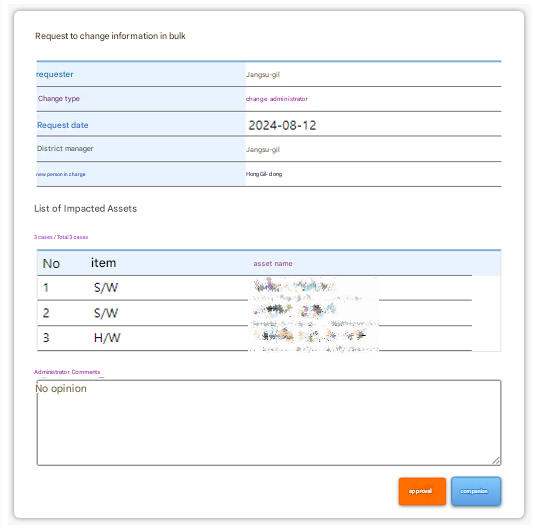

Recently, there was a requirement to **"approve bulk change requests"** for multiple assets for a work project.

To explain a bit more concretely:


This is a simplified data model. (In reality, the assets table has many relationships with other tables.)

There is an **asset** entity called asset, and a user entity called users, and each asset has one **manager**.

"Bulk change" means modifying multiple assets at once according to specific requirements.

For example, if manager A resigns, it means changing all the assets managed by A to be managed by B.

Additionally, these changes are not applied immediately but are registered as requests and later approved by a system administrator.

I looked into database design methodologies and the actual implementation process to address these requirements.

# Main Text

Since requests must be persisted, they ultimately need to be stored in the database.

When designing the request as a table, it can be configured as follows.


You can store manager change requests using old_manager_id and new_manager_id.

## Is it enough to only change the manager?

However, such a table design has one problem.

It can **only** accommodate manager changes.

If the target of the bulk change is something other than the manager, this table cannot accept the request.

For example, if there is a new requirement to extend the expiration date by one month for assets with less than one week remaining until disposal, this design cannot accommodate it.

## Things that change and things that don’t

If we bring in a bit of object-oriented thinking, we can discover a kind of inheritance relationship.

Request ID, approval date, requester, status, and reason are attributes shared by any request.

On the other hand, specific change attributes like old_manager_id can vary.

In databases, this kind of relationship is called a Polymorphic Association, and there are several approaches to handling it.

## Option 1: Table Inheritance Pattern ([🔗 Single Table Inheritance](https://www.martinfowler.com/eaaCatalog/classTableInheritance.html))


Looking at the code:

```sql
CREATE TABLE requests (
    request_id INT AUTO_INCREMENT PRIMARY KEY,
    request_date TIMESTAMP,
    ... (omitted)
)

CREATE TABLE manager_change_requests (
    request_id INT,
    old_manager_id INT,
    new_manager_id INT

    FOREIGN KEY (request_id) REFERENCES requests
)

CREATE TABLE waste_date_extension_requests {
    id request_id INT,
    expiry_time TIMESTAMP,
    plus_time TIMESTAMP

    FOREIGN KEY (request_id) REFERENCES requests
}
```

Using the Class Table Inheritance relationship in RDB, you can map the fields of variable modification details.

Although it may feel unnatural that one column has PKs across multiple tables,

by delegating the common attributes to the Requests table, you can manage only the variable details in separate tables.

## Option 2: Exclusive Arc Pattern


In this method, the Requests table holds foreign keys to all the detail tables.

One thing to be careful of in this approach is that exactly one of the foreign keys to the detail tables must have a value, and the others must be NULL.

Otherwise, a single request could be associated with multiple detail tables, compromising integrity.

This constraint must be enforced at the database level or in the application layer. (e.g., using SQL CHECK constraints)

## Option 3: [🔗 Serialized LOB Pattern](https://www.martinfowler.com/eaaCatalog/serializedLOB.html)


This is a pattern that stores serialized changes in the edit_detail column.

The existing detail table is stored in JSON format, for example:

```json
{
  "old_manager_id": 1231231,
  "new_manager_id": 9999999
}
```

If your DBMS supports JSON data types like MySQL, you can use this approach.

## Pros, Cons, and Choice

### Option 1 (Table Inheritance)

Table inheritance is the most common approach and is more normalized.

However, every time you add a new type of request detail, the number of tables increases.

### Option 2 (Exclusive Arc)

While the exclusive arc pattern is intuitive, its disadvantage is that if constraints are not enforced, it cannot guarantee data integrity.

Ultimately, you must enforce constraints both at the database and application levels, but implementing database-level constraints differs depending on the vendor,

and additional exception handling at the application level is also needed.

[Why you should not use Exclusive Arc](https://books.google.com.au/books?id=7ZAk0YiKQV0C&pg=PA110&lpg=PA110&dq=%22exclusive%2Barc%22%2Bdatabase&source=bl&ots=AyNPWsac__&sig=gBFIerXckQlVpRdd6ycI5JEgq3U&hl=en&ei=PzGzSZfrFcPVkAWWyZDZBA&sa=X&oi=book_result&resnum=1&ct=result#v=onepage&q&f=false)

### Option 3 (Serialized LOB)

Serialized LOBs store the details as JSON or strings, requiring deserialization in the application.

Generally, CPU-bound serialization work has performance overhead, but given that this is a batch-style request/approval system,

I judged that the overhead wouldn’t have a significant impact on perceived performance.

Also, if you use JSON column types, you can overcome the drawback of LOBs that make querying impossible (e.g., querying how many requests changed the manager to 1231231).

---

Based on the above pros and cons, and considering that the details of bulk changes were likely to change frequently in the early stage, I chose option 3, which is relatively flexible.

## Implementation

Once option 3 was selected, deserialization became a task to be addressed in implementation.

The summarized requirements of bulk change details are as follows:

1. When an administrator approves, the relevant assets are updated appropriately
2. Output the list of affected assets

While maintaining the abstraction of bulk change, I implemented it with consideration for whether it would be possible to extend the system by simply adding new detail types while adhering to the OCP principle.

I attached an image excluding sensitive content to aid understanding of the requirements.



First, I wrote a marker interface that abstracts the change details.

It is only to enforce type constraints and has no internal methods.

deserialize method deserializes the string-form JSON change details into Java objects.

BulkUpdateProcessor depends on BulkUpdateDetail, forming dependencies only across abstraction layers.

Now, we need to solve how to select the appropriate processor at runtime depending on the category of the details (e.g., whether to process manager changes or disposal date extensions).

In a naive approach, you can solve this with a simple switch or if-else statement using the factory pattern.

One of the advantages of Spring dependency injection is that when you inject a collection, it is filled with subtypes of the specified generic type.

This made it possible to extend functionality by implementing only child classes, without modifying existing code.

Below is a class diagram that consolidates the implementation so far.


# Conclusion

The goal of this project—implementing the bulk change request approval system—

could have been achieved by simply implementing manager changes, but by designing with extensibility in mind,

I was able to think more deeply about database inheritance modeling and object orientation.

Meeting requirements is important, but as in this case, considering extensibility and trade-offs when various options are available,

and selecting the approach that fits the current situation is what I believe makes good engineering.

## Reference

- [https://stackoverflow.com/questions/3579079/how-can-you-represent-inheritance-in-a-database](https://stackoverflow.com/questions/3579079/how-can-you-represent-inheritance-in-a-database)
- [https://www.martinfowler.com/eaaCatalog/serializedLOB.html](https://www.martinfowler.com/eaaCatalog/serializedLOB.html)
- [https://www.martinfowler.com/eaaCatalog/classTableInheritance.html](https://www.martinfowler.com/eaaCatalog/classTableInheritance.html)
- [https://stackoverflow.com/questions/922184/why-can-you-not-have-a-foreign-key-in-a-polymorphic-association/922341#922341](https://stackoverflow.com/questions/922184/why-can-you-not-have-a-foreign-key-in-a-polymorphic-association/922341#922341)

```

```
