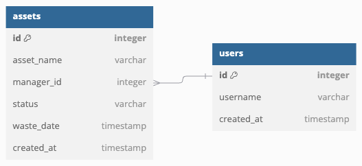

# 서론 

최근 업무를 위해 여러개의 자산에 대해서 **"일괄 변경의 요청 승인"**을 해야 하는 요구사항이 있었습니다.

조금 더 구체적으로 설명을 하자면 다음과 같습니다



간소화시킨 데이터 모델입니다. (실제로는 assets 테이블이 다른 테이블과 많은 연관관계를 갖고 있습니다)

asset이라는 **자산** 엔티티가 있으며, users라는 사용자 엔티티가 존재하고 각 자산은 하나의 **관리자**를 갖습니다.

"일괄 변경"이란 여러개의 자산을 특정 요구사항에 맞추어 한꺼번에 변경하는 것을 의미합니다.

예를 들어, 담당자 A가 퇴사하게 되면 A가 담당하고있던 자산들의 담당자를 모두 B로 변경하는것을 의미합니다

또한 이 변경사항들은 즉시 적용이 되는것이 아니라 요청으로 등록되고, 시스템 관리자가 이후에 승인하는 형태로 구성되어야 합니다.

이러한 요구사항들에 대응하는 데이터베이스 설계 방법론과 실제 구현과정까지 알아보았습니다.

# 본론

요청은 영속해야하기때문에 결국 데이터베이스에 저장되어야 합니다.

요청을 테이블로 설계하게 되면 다음과 같이 구성이 가능합니다.


old_manager_id 와 new_manager_id 를 통해서 담당자 변경 요청을 저장할 수 있습니다.

## 담당자만 변경하면 될까 ? 

하지만 이와 같은 테이블 설계는 한가지 문제가 존재합니다.

바로 **담당자의 변경만** 수용 가능하다는 것입니다.

만약 일괄 변경의 대상이 담당자가 아니라면 이 테이블로 요청을 수용할 수 없게 됩니다.

예를 들어, 폐기일 만료가 일주일 남은 자산들을 모두 한달 연장하는 새로운 요구사항에는 대응할 수 없습니다.

## 변하는 것과 변하지 않는 것

약간의 객체지향적 사고를 끌어와서 살펴본다면, 일종의 상속관계를 발견할 수 있습니다.

요청 ID, 승인 날짜, 요청자, 상태, 요청 사유는 어떤 요청이든지 공유되는 속성입니다.

반대로 old_manager_id 등의 구체적인 변경 속성은 변할 수 있습니다. 

데이터베이스에서 이와 같은 관계를 Polymorphic Association이라고 부르며, 몇가지 접근 방식들이 존재합니다.

## 옵션 1: 테이블 상속 패턴 ([🔗 Single Table Inheritance](https://www.martinfowler.com/eaaCatalog/classTableInheritance.html))


코드로 살펴보면 다음과 같습니다

```sql

CREATE TABLE requests (
    request_id INT AUTO_INCREMENT PRIMARY KEY,
    request_date TIMESTAMP,
    ... (중략)
)

CREATE TABLE manager_change_requests (
    request_id INT,
    old_manager_id INT,
    new_manager_id INT

    FOREIGN KEY (request_id) REFERENCES requests
)


CREATE TABLE waste_date_extension_requests {
    id request_id INT,
    expiry_time TIMESTAMP,
    plus_time TIMESTAMP

    FOREIGN KEY (request_id) REFERENCES requests
}

```


Class Table Inheritance 방식으로 불리는 RDB 연관관계를 통해서 변동성 있는 수정 세부사항의 필드들을 매핑할 수 있습니다.

하나의 칼럼이 여러개의 테이블에 대해서 PK를 맺고 있는 것이 부자연스러울 수 있지만, 

공통 속성을 Requests 테이블에 위임하는것을 통해 변동되는 세부사항만 별도의 테이블들로 관리할 수 있습니다.

## 옵션 2: 배타적 관계 : 🔗 Exclusive Arc 패턴


Requests 테이블이 각 세부사항 테이블에 대한 외래키를 모두 보유하는 방식입니다.

해당 방식에서 주의해야 할 점은 세부사항 테이블의 외래키는 반드시 하나만 값을 갖고, 나머지는 NULL을 가져야 하는 것입니다.

그렇지 않는다면, 하나의 요청이 여러개의 세부사항 테이블과 연관되어 무결성에 손상을 줄 수 있습니다.

이것은 데이터베이스 또는 애플리케이션 레벨에서 제약조건을 준수하도록 구성해야만 합니다. (SQL CHECK 문 등)

## 옵션 3: [🔗 직렬화 LOB (Serialized LOB) 패턴](https://www.martinfowler.com/eaaCatalog/serializedLOB.html)


edit_detail 칼럼에 직렬화된 변경사항들을 저장하는 패턴입니다.

기존 세부사항 테이블이 JSON의 형태로 저장되며, 예를 들면 다음과 같습니다.

```json
{
    "old_manager_id": 1231231,
    "new_manager_id": 9999999
}
```

MYSQL과 같이 JSON 데이터타입을 지원한다면 사용할 수 있습니다.

## 장단점과 선택

### 옵션 1 (테이블 상속)

테이블 상속 방식의 경우, 가장 일반적이며 정규화가 더 적용되어있는 형태입니다.

세부사항의 요청 종류가 추가될때마다 테이블의 개수는 증가합니다.

### 옵션 2 (배타적 관계)

배타적 관계 패턴은 직관적이지만, 제약조건을 강제하지 않으면 데이터의 무결성을 보장하지 못한다는 점이 단점입니다.

결국 데이터베이스단과 어플리케이션 두 레벨에서 제약조건을 강제해야 하는데, 데이터베이스 레벨의 제약조건은 벤더마다 구현방식이 다르며, 

애플리케이션 레벨의 별도 예외처리 또한 필요합니다.

[배타적 아크를 사용하면 안되는 이유](https://books.google.com.au/books?id=7ZAk0YiKQV0C&pg=PA110&lpg=PA110&dq=%22exclusive%2Barc%22%2Bdatabase&source=bl&ots=AyNPWsac__&sig=gBFIerXckQlVpRdd6ycI5JEgq3U&hl=en&ei=PzGzSZfrFcPVkAWWyZDZBA&sa=X&oi=book_result&resnum=1&ct=result#v=onepage&q&f=false)

### 옵션 3 (Serialized LOB)

세부사항이 하나의 JSON 또는 문자열로 저장되어있는 Serialized LOB는 애플리케이션에서 역직렬화를 요구합니다.

일반적으로 CPU Bound 한 직렬화 작업은 성능적으로 오버헤드가 존재하지만, 배치형태로 처리되는 요청/승인 시스템의 특성상

해당 오버헤드가 성능 체감에 큰 영향을 주지 않을것이라고 판단하였습니다.

또한 JSON 칼럼 타입을 사용하면 LOB형태를 사용했을때의 단점인 검색 쿼리가 불가능하다 (EX: 관리자가 1231231인 담당자 변경 요청이 몇개나 이루어졌는지 쿼리)

는 단점도 극복 가능합니다.

---

앞서 서술한 장단점들과 초기 단계에서는 일괄변경의 세부사항들이 자주 변경될것이라고 생각했기 때문에 상대적으로 유연한 3번을 선택하였습니다

## 구현

3번을 선택한 이상 역직렬화라는 숙제를 구현으로 풀어나가야 합니다. 

일괄 변경사항의 요구사항을 요약하면 다음과 같습니다 : 

1. 관리자가 승인할 경우, 해당하는 자산들을 적절하게 업데이트
2. 영향받는 자산목록들을 출력한다

일괄변경이라는 추상화를 유지하면서 OCP 원칙을 준수하여 세부사항만 추가하는 방식으로 확장이 가능할지 고려하면서 구현하였습니다

요구사항의 이해를 돕기 위해 민감내용을 제외한 이미지를 첨부하였습니다


가장 먼저 변경 세부사항을 추상화한 마커 인터페이스를 작성하겠습니다

타입을 강제하기 위한 것으로, 내부 메소드는 없습니다

```java
public interface BulkUpdateDetail { }
```
담당자 변경 세부사항의 Java 클래스 구현체입니다


```java
@Getter
@Setter
@NoArgsConstructor(force = true)
public class BulkUpdateManagerDetail implements BulkUpdateDetail {
    private int oldManagerId;
    private int newManagerId;
}
```

일괄변경 처리를 수행하는 처리기 클래스인 BulkUpdateProcessor 추상 클래스를 작성하겠습니다.


```java
public abstract class BulkUpdatProcessor {

    protected <T exends BulkUpdateDetail> T deserialize(String json, Class<T> detailClass) {
        ObjectMapper mapper = new ObjectMapper();
        try {
            return mapper.readValue(json, detailClass);
        } catch(JsonProcessingException e) {
            throw new RuntimeException("Unable to deserialize : " + json + "for category: " + getCategory());
        }
    }

    public abstract void processUpdate(String json);

    public abstract List<Integer> getAffectedAssets(String json);

    public abstract String getCategory();
}

```

deserialize 메소드는 JSON이 문자열 형태로 직렬화된 변경 세부사항을 역직렬화하여 자바객체로 변환시켜주는 추상 메소드입니다.                               

BulkUpdateProcessor가 BulkUpdateDetail을 의존하는 형태로, 추상화 계층간 의존관계만 존재합니다.

이제 세부사항의 종류 (category)에 따라 달라지는 처리기를 어떻게 선택해 줄 지 해결해야 합니다.

category에 따라서 담당자의 일괄변경을 처리할 지, 폐기날짜의 일괄변경을 처리할 지 런타임에 선택할 수 있어야 합니다.

나이브한 방식으로는 다음과 같이 팩토리 패턴을 사용한 간단한 switch 또는 if-else 문으로 해결할 수 있습니다


```java
@Component
public class BulkUpdateProcessorFactory {

    public get(String key) {
        return switch(key) {
            case "manager_change" -> new ManagerChangeUpdateProcessor();
            case "waste_date_extension" -> new WasteDateExtensionProcessor();
            default -> throw new RuntimeException("Not Supported");
        }
    }
}
```

또는 스프링의 DI 기능을 활용하여 switch 문에 수정이 필요없게 만들 수 있습니다.


```java
@Component
public class BulkUpdateProessorFactory {
    private final HashMap<String, BulkUpdateProessor> procesorMap = new HashMap<>();

    @Autowired
    public BulkUpdateProessorFactory(List<BulkUpdateProcessor> processors) {
        for(BulkUpdateProcessor processor: processors) {
            processorMap.put(processor.getCategory(), processor);
        }
    }

    public BulkUpdateProcessor get(String key) {
        return processorMap.get(key);
    }
}

```

스프링 의존성 주입의 장점 중 하나는 컬렉션을 주입할 경우, 컬렉션이 인자로 주어진 제네릭의 서브타입들로 채워지는것입니다.

BulkUpdateProcessor의 구상 클래스를 다음과 같이 작성할 수 있습니다

```java
@Component
public class BulkUpdateManagerProcessor extends BulkUpdateProcessor {
    private final AssetDAO assetDAO;

    public BulkUpdateManagerProcessor(AssetDAO assetDAO) {
        this.assetDAO = assetDAO;
    }

    @Override
    public void processUpdate(String json) {
        BulkUpdateManagerDetail updateDetail = deserialize(json, BulkUpdateManagerDetail.class);

        var do = UpdateManagerRequestDto.builder()
                    .oldManagerId(updateDetail.getOldManagerId())
                    .newManagerId(updateDetail.getNewManagerId())
                    .build();
        
        asetDAO.updateManagerId(dto);
    }

    @Override
    public List<Integer> getAffectedAssets(String json) {
        BulkUpdateManagerDetail updateDetail = deserialize(json, BulkUpdateManagerDetail.class);
        return assetDAO.selectAssetNoInChargeByManagerId(updateDetail.getOldManagerId());
    }

    @Override
    public String getCategory() {
        return "manager_change"; //ENUM + 테이블 분리로 구성하는것이 맞지만 분량상 생략
    }
}

```

실제 서비스 코드를 간단하게 살펴보면 다음과 같습니다 (팀 컨벤션상 DAO + Map 조합을 사용하였습니다)


```java
@Transactional
public void processBulkUpdateRequest(BulkUpdateProcessCommand command) {
    if(!command.getResult()) {
        return;
    }

    BULK_EDIT bulkEdit = bulkDAO.selectBulkEditById(command.getRequestId());
    var processor = bulkUpdateProcessorFactory.get(bulkEdit.getCategory());
    var map = new HashMap<String, Object>();
    map.put("manager_comment",command.getComment());
    map.put("request_id", command.getRequestId());
    map.put("status", command.getResult());
    bulkDAO.approveBulkEditRequest(map);

}

```

이렇게 자식 클래스만을 추가적으로 구현하는것을 통해 코드의 변경 없이 확장이 가능하게 되었습니다.

아래는 지금까지의 구현을 하나로 그린 Class Diagram입니다


# 결론

이번 업무목표였던 일괄변경의 요청 승인 시스템 구현은

단순히 담당자 변경 하나만 구현할 수 있었지만, 확장성을 고려하여 구현하면서

데이터베이스의 상속관계 구현과 객체지향에 대해서 한단계 더 깊이 고민해 볼 수 있었습니다.

요구사항을 만족하는것도 중요하지만, 이번 사례처럼 확장성을 고려하고 다양한 선택지가 주어졌을 때, 트레이드오프를 고려하면서

현재 상황에 맞는 방식을 선택하는것이 좋은 엔지니어링이라고 생각합니다


## Reference

* https://stackoverflow.com/questions/3579079/how-can-you-represent-inheritance-in-a-database
* https://www.martinfowler.com/eaaCatalog/serializedLOB.html
* https://www.martinfowler.com/eaaCatalog/classTableInheritance.html
* https://stackoverflow.com/questions/922184/why-can-you-not-have-a-foreign-key-in-a-polymorphic-association/922341#922341
