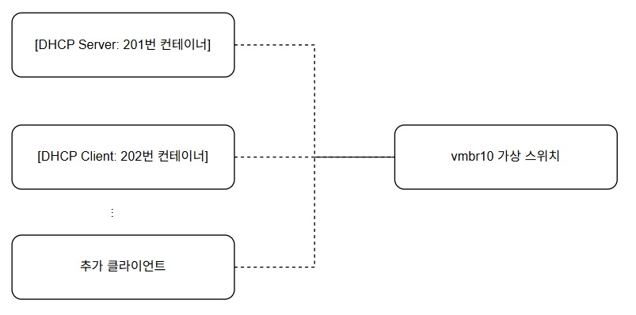

최근 IT 서비스의 배포는 AWS, GCP와 같은 클라우드 환경을 중심으로 이루어지고 있습니다.  
하지만 사이드 프로젝트나 테스트 용도라면, 굳이 클라우드를 사용할 필요가 없다고 느꼈습니다.  
시대의 흐름을 역행하고 최근 미니PC를 사용한 홈서버로 회귀하는 과정을 담아 글을 작성해 보았습니다.

1. 가성비  
   클라우드는 생각보다 비용이 많이 발생합니다.
   단순한 웹 애플리케이션이라도 컨테이너 기반의 백엔드, 프론트엔드, RDBMS를 함께 운영하려면
   최소 4GB RAM 이상이 필요하며, AWS 기준으로 t3.medium 인스턴스의 월 요금은 약 3만~4만 원입니다.

2. 직접 구축과 실습 경험
   클라우드는 대부분의 기능을 UI 기반으로 빠르게 제공하지만,
   실제 인프라를 손수 구축하는 경험을 하기는 어렵습니다.
   홈서버를 직접 구축하면 운영체제 설치, 네트워크 구성, 컨테이너/가상화 환경 설정 등
   인프라의 세부적인 구조와 동작 원리를 직접 체험할 수 있습니다.

3. 복잡성
   클라우드의 중요성을 부정할 생각은 없지만,  
   사이드 프로젝트 용도로는 오히려 불필요하게 복잡한 면도 존재합니다.  
   IAM(권한 관리), 네트워크, 보안 설정 등 신경 써야 할 부분이 많고,
   예상치 못한 곳에서 소액 결제가 지속적으로 발생하기도 합니다.  
   (지금도 어딘가에서 돈 빠져나가는중임)
   

# 초기 세팅

라즈베리 파이 등 소형 보드도 고려했지만,
미니PC(4코어 16GB 램, SSD)를 20만 원 초반대에 구입하여 시작했습니다.  
별다른 고민 없이 그냥 컴퓨터에 리눅스 배포판을 설치하였고 도커를 이용해 이미지를 받아 컨테이너를 실행하였습니다.  
원격에서 접속 및 관리가 가능하도록 포트 포워딩을 설정했습니다.

# Proxmox

단순히 리눅스를 설치해 사용하는 것은 몇 가지 불편함이 있었습니다.  
원격 접속(SSH, VNC 등)이 불가능할 때에는 직접 모니터와 키보드를 연결해야 했고,  
여러 서비스를 한 서버에 모두 올리는 구조는 관리와 백업에 제약이 있었습니다.  
불편하게 살아가던 와중 Proxmox라는 서비스를 알게 되었습니다.
Proxmox는 오픈소스 기반의 서버 가상화 플랫폼으로,  
웹 UI를 통해 가상머신과 LXC 컨테이너를 손쉽게 관리할 수 있습니다.

Proxmox의 편리한 점은 구동된 이후엔 동일한 네트워크에 있는 기기를 통해 웹 UI에 접속할 수 있다는 것입니다.  
매번 입출력 장치를 갈아끼우거나 두개씩 운용하지 않아도 된다는 장점이 있습니다.

<!-- (Proxmox 같은 네트워크라는것은 와이파이로는 안된다는것 까먹지 말것 그래서 허브도 샀음 KVM도 샀음 ㅡㅡ) -->


# 격리

<!-- LXC 컨테이너나 Proxmox를 이용하는 이유 + 도커와의 비교 -->
<!-- 나중에 KVM과 LXC 의 차이도 가능하면 설명 -->

이전 리눅스 셋업과 동일하게 Proxmox에서 하나의 VM을 생성하고 그 위에 도커를 통해 원하던 컨테이너들을 모두 실행시키는 것도 가능하지만,

이번에는 도커를 통한 어플리케이션 수준 격리와 LXC를 통한 시스템 레벨의 격리를 (Containerization) 수행해보려고 합니다.

<!-- 실제 셋업에서는 이런 환경을 구축하는 이유가 네트워크 격리/보안/운영체제호환성(리눅스에서는 윈도우도커못돌림)/스냅샷과마이그레이션용이 -->

최종적인 형태는 다음과 같습니다.

각 LXC 컨테이너간 통신이 가능하기 위해선 네트워크 브릿지가 필요합니다.

네트워크 브릿지는 일종의 가상 네트워크 스위치로, 현실세계의 물리 스위치와 유사하게 L2 레이어에서 작동합니다.

Proxmox에서는 브릿지를 통해 VM과 컨테이너들을 외부 인터넷과 연결시키고, 특정 컨테이너끼리 네트워크 통신이 가능한 망을 구축합니다.

직접 하나씩 만들어 보는 과정을 살펴보겠습니다.

```powershell
nano /etc/network/interfaces
```

파일 아래에 다음과 같이 두개를 추가합니다.

```powershell
auto vmbr1
iface vmbr1 inet static
    address 10.10.10.1
    netmask 255.255.255.0
    bridge_ports none
    bridge_stp off
    bridge_fd 0

auto vmbr2
iface vmbr2 inet static
    address 10.20.20.1
    netmask 255.255.255.0
    bridge_ports none
    bridge_stp off
    bridge_fd 0
```

다음 명령어를 통해 정상적으로 생성됐는지 확인이 가능합니다.  
물론 Proxmox의 GUI 에서도 확인 가능합니다.

```sh
ifreload -a
ip a | grep vmbr
```


다음 단계는 이 브릿지를 가진 LXC 컨테이너들을 만드는 것입니다.

두개의 컨테이너를 만들어 보겠습니다.

```sh
pct create 201 local:vztmpl/ubuntu-22.04-standard_22.04-1_amd64.tar.zst \
   --hostname lxc-net1 \
   --cores 1 \
   --memory 512 \
   --rootfs local-lvm:8 \
   --net0 name=eth0,bridge=vmbr1,ip=10.10.10.10/24 \
   --unprivileged 1 \
   --start

pct create 202 local:vztmpl/ubuntu-22.04-standard_22.04-1_amd64.tar.zst \
   --hostname lxc-net2 \
   --cores 1 \
   --memory 512 \
   --rootfs local-lvm:8 \
   --net0 name=eth0,bridge=vmbr2,ip=10.20.20.10/24 \
   --unprivileged 1 \
   --start
```

성공적으로 생성된것을 확인할 수 있습니다.


생성한 브릿지 덕분에 201번 컨테이너와 202번 컨테이너가 호스트와 통신이 가능합니다.
하지만 201번 컨테이너와 202번 컨테이너간의 소통은 라우팅 설정을 하지 않는 이상 불가능합니다.


호스트를 라우터로 활용하여 두 컨테이너간 소통이 가능하게 하는것 또한 가능합니다.

# DHCP

지금까지 각 컨테이너마다 IP 주소를 수동으로 지정해서 네트워크를 구성했습니다.

하지만 서버나 디바이스가 많아지면, 하나하나 직접 IP를 지정하는 작업은 번거롭고 오류의 여지가 많아집니다.

실제로 일반적인 회사 네트워크, 학교, 카페, 그리고 가정의 Wi-Fi까지 대부분의 환경에서는

DHCP(Dynamic Host Configuration Protocol)를 사용해 자동으로 IP 주소를 할당합니다.

실제로 우리가 Wi-Fi에 접속할 때 별도의 설정 없이 인터넷을 사용할 수 있는 이유도 바로 DHCP 덕분입니다.

직접 Proxmox를 통해 DHCP 서버를 구축해보겠습니다.

최종 목표는 다음과 같습니다 :

- vmbr10: 가상 브릿지

- 201번 컨테이너: DHCP 서버 역할, 정적 IP(10.10.10.1/24) 할당

- 202번 컨테이너: DHCP 클라이언트, 네트워크 설정을 DHCP로 변경

그림으로 나타내면 다음과 같습니다.



먼저 컨테이너끼리 연결을 시킬 수 있도록 vmbr10 가상 브릿지를 생성하겠습니다.

하단에 아래 내용을 추가하고 적용합니다.

```sh
nano /etc/network/interfaces

auto vmbr10
iface vmbr10 inet static
    address 10.10.10.1
    netmask 255.255.255.0
    bridge_ports none
    bridge_stp off
    bridge_fd 0

ifreload -a
```

이제 이전에 생성한 201과 202 컨테이너를 DHCP로 연결해보겠습니다.

DHCP 서버 역할을 수행할 201번 컨테이너의 네트워크 설정을 진행하겠습니다.

```sh
nano /etc/pve/lxc/201.conf

# 아래와 같이 변경
net0: name=eth0,bridge=vmbr10,ip=10.10.10.1/24
```

202번 컨테이너도 마찬가지로 변경합니다.

```sh
nano /etc/pve/lxc/202.conf

net0: name=eth0,bridge=vmbr10,ip=dhcp
```


201번 컨테이너에 DHCP 서버를 설치 및 설정합니다.

```sh
pct enter 201

# DHCP 서버 패키지 설치
apt update
apt install isc-dhcp-server

# DHCP 설정 파일 편집
nano /etc/dhcp/dhcpd.conf
# 아래와 같이 작성
subnet 10.10.10.0 netmask 255.255.255.0 {
    range 10.10.10.100 10.10.10.200;
    option routers 10.10.10.1;
    option domain-name-servers 8.8.8.8, 1.1.1.1;
    default-lease-time 600;
    max-lease-time 7200;
}

# 인터페이스 지정
nano /etc/default/isc-dhcp-server
# 아래처럼 eth0 지정
INTERFACESv4="eth0"

# 서비스 재시작
systemctl restart isc-dhcp-server
systemctl status isc-dhcp-server
```

이제 202번 (DHCP 클라이언트)의 IP를 확인할 수 있습니다.

설정한대로 eth0에 10.10.10.100~200 사이의 대역이 할당되어있어야 합니다.

```sh
pct enter 202

ip a
```


# 원격 접속

방금까지 수행한 과정은 Proxmox 호스트에서 직접 수행하였습니다.

다만 Proxmox의 웹 GUI는 동일한 네트워크 아래에서만 가능하다는 한계점이 존재했습니다.

<small>
여담이지만, Proxmox Web GUI는 무선 네트워크로 접속이 불가능합니다.  
정확히는, 호스트가 인터넷에 무선으로 연결되어있을 경우, web gui 접속이 불가능합니다.  
무선랜카드로 접속하려고 시도했었지만 안되더라구요.   
공홈에서도 권장하지 않는 방식이라고 합니다.   
결국 허브를 구매했어요...
</small>

가장 간단하게 시도할 수 있는 방법은 라우터의 포트 포워딩 기능을 활용하는 것입니다.
실제로 순정 리눅스 서버를 구축할 때 저 역시 이 방법을 사용했습니다.

예를 들어, 집에서 사용하는 공유기에서 외부 포트 8006(기본 Proxmox 관리 포트)를

Proxmox 서버의 내부 IP(예: 192.168.1.100) 8006 포트로 포워딩할 수 있습니다.

```sh
[외부 PC] --(인터넷)--> [공인 IP:8006] ==[집 공유기]==> [Proxmox:8006]
```

이렇게 설정하면, 외부에서 내 집 인터넷(공인 IP) 주소의 8006 포트로 접속할 수 있게 됩니다.

하지만 이 방식에는 몇가지 심각한 보안 문제가 존재합니다.

- **공개된 포트**  
  인터넷에 바로 노출된 포트는 자동화된 스캔 및 공격 대상이 되기 쉽습니다.
  특히 8006, 22(SSH) 등은 공격 빈도가 매우 높습니다.

클라우드와 다르게 자체적으로 지원하는 보안 기능들이 없는 홈서버는 이러한 위협에 취약합니다.

실제로 과거 서비스를 배포하기 위해 포트를 열어두었다 외부의 포트스캔 시도를 받은 적 또한 있습니다.

자신의 기기가 채굴기로 전락하는 상황을 피하고 싶다면 안전한 경로를 구축할 필요가 있습니다.

## Wireguard

이러한 위험을 줄이고, 보안성을 강화한 원격 접속을 구현하는 대표적인 방법은
**VPN(Virtual Private Network)**을 활용하는 것입니다.

특히 최근에는 WireGuard가 경량/고속/간단한 설정의 장점으로 많이 사용되고 있습니다.

### Wireguard 구성

1. Proxmox 호스트에 WireGuard 설치

   ```sh

   apt update
   apt install wireguard
   wg --version
   ```

2. 키 쌍 생성

   ```sh

   # server
   umask 077
   wg genkey | tee server_private.key | wg pubkey > server_public.key

   # client
   wg genkey | tee client_private.key | wg pubkey > client_public.key
   ```

3. 호스트 설정

   ```sh

   # nano /etc/wireguard/wg0.conf
   [Interface]
   Address = 10.0.0.1/24
   ListenPort = 51820
   PrivateKey = <server_private_key>

   [Peer]
   PublicKey = <client_public_key>
   AllowedIPs = 10.0.0.2/24
   ```

4. 클라이언트 설정

   wireguard 클라이언트가 존재하는 mac 으로 진행하였습니다.

   ```sh

   [Interface]
   Address = 10.0.0.2/24
   PrivateKey = <client_private_key>

   [Peer]
   PublicKey = <server_public_key>
   Endpoint = <your_public_ip>:51820
   AllowedIPs = 10.0.0.0/24, 192.168.0.0/24
   ```

### 결과


이로서 안전한 원격 개발 및 운영 환경을 갖출 수 있었습니다.

---

### 여담

이 셋업 하겠다고 30만원은 쓴것같다...


