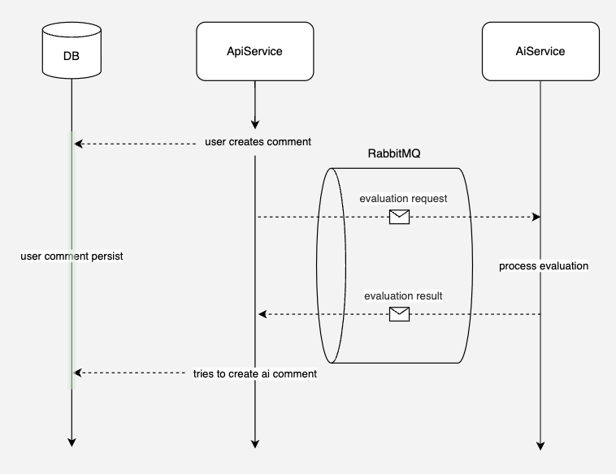
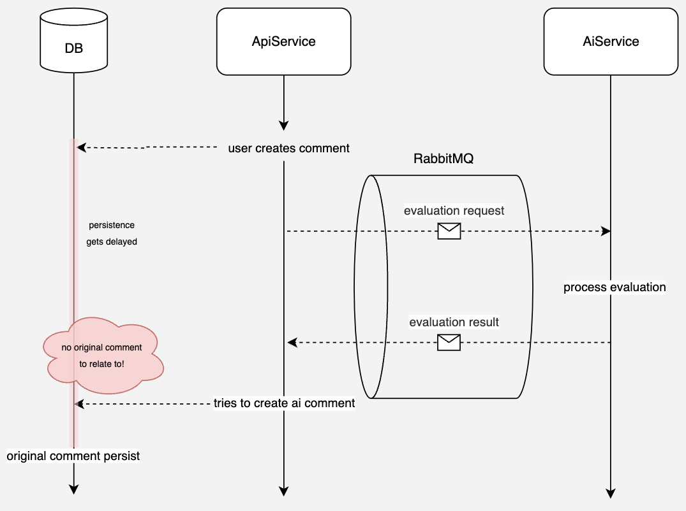
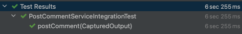
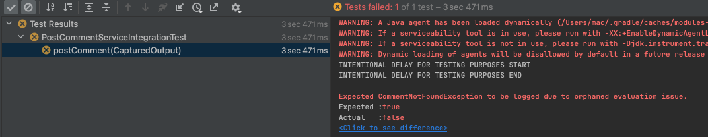

최근 마이크로서비스 아키텍처와 이벤트 기반 시스템이 널리 사용되면서, 비동기 작업 처리 및 느슨한 결합을 구현하기 위해 메시지 큐(RabbitMQ, Kafka 등)와 같은 메시징 시스템이 자주 사용되고 있습니다.  
이러한 방식은 서비스 간의 독립성을 유지하고, 확장성과 유연성을 크게 향상시킬 수 있는 장점을 제공합니다.

그러나 이벤트 기반으로 비동기 작업을 처리할 때, 데이터 일관성을 보장하는 것은 중요한 도전 과제입니다.  
특히, 비동기 작업의 실행 순서가 예상과 다르게 동작하거나, 특정 작업이 아직 완료되지 않은 상태에서 이벤트가 소비될 때 데이터 무결성이 깨지는 상황이 발생할 수 있습니다.

이 글에서는 이벤트 기반 아키텍처를 사용할 때 발생할 수 있는 데이터 무결성 문제를 소개하고, 예제로 문제 상황을 재현하며 이를 해결할 수 있는 방법을 탐구합니다.  
특히, 비동기 메시징 시스템과 데이터베이스의 트랜잭션 처리 사이의 비동기성 문제를 식별하고 이를 안전하게 해결하는 방법을 설명합니다.

## 문제상황

두 개의 서비스로 구성된 간단한 구조를 예시로 들어 설명하겠습니다.  
이 예시는 유저가 생성한 댓글에 자동으로 AI가 해당 댓글에 대한 평가를 추가해주는 시스템을 구축하는 과정에서 발생할 수 있는 문제를 다룹니다.

**💡 시스템 구성**

1. **API 서비스 (api-service)**
   - 유저, 게시판, 댓글 등을 관리하는 서비스.
   - 유저가 게시물에 댓글을 달면, 해당 댓글을 데이터베이스에 저장합니다.
   - 댓글이 등록되면 메시지 큐(RabbitMQ)를 통해 AI 서비스에 평가 요청 메시지를 보냅니다.
2. **AI 서비스 (ai-service)**
   - 외부 AI API를 사용하여 댓글의 내용을 분석하고 평가를 생성합니다.
   - 평가 결과를 다시 메시지 큐를 통해 API 서비스로 전달합니다.

**💡 흐름 (Flow)**

1. 사용자가 댓글을 작성하여 API 서비스에 전달합니다.
2. API 서비스는 댓글을 데이터베이스에 저장하고, 동시에 평가 요청 메시지를 메시지 큐에 발행합니다.
3. AI 서비스는 메시지 큐로부터 평가 요청을 받아 외부 AI API로부터 평가 결과를 생성합니다.
4. AI 서비스는 평가 결과를 메시지 큐를 통해 API 서비스로 다시 전달합니다.
5. API 서비스는 평가 결과를 받아 댓글과 연관지어 데이터베이스에 저장합니다.

간단한 다이어그램은 다음과 같습니다.



여기까진 딱히 문제가 보이지 않습니다.

이제 다음과 같은 상황을 가정해봅시다.

🔍 비동기 처리의 타이밍 문제

1. API 서비스가 댓글을 데이터베이스에 저장하기 전에 평가 요청 메시지를 메시지 큐에 발행하는 상황:

   - API 서비스는 댓글을 데이터베이스에 저장하는 과정에서 트랜잭션 처리 또는 네트워크 지연 등으로 인해 일정 시간 지연될 수 있습니다.
   - 그러나 메시지 큐에 평가 요청 메시지를 발행하는 작업은 비동기로 즉시 수행됩니다.
   - 결과적으로, AI 서비스는 댓글 저장이 완료되기 전에 평가 요청 메시지를 받아 처리하게 됩니다.

2. AI 서비스의 응답이 API 서비스의 댓글 저장보다 먼저 도착하는 상황:
   - AI 서비스는 요청을 빠르게 처리하고 평가 결과를 메시지 큐를 통해 API 서비스로 다시 전송합니다.
   - 이때, API 서비스는 평가 결과를 처리하기 위해 데이터베이스에서 원본 댓글을 조회하지만, 아직 댓글이 저장되지 않은 상태이기 때문에 조회에 실패하게 됩니다.
   - 예외가 발생하며, 이 평가 결과는 데이터베이스와 연관될 수 없는 고아 데이터(orphaned data)가 됩니다.

&nbsp;



## 문제상황 재현

실제 코드를 통해서 해당 문제상황을 살펴보겠습니다.  
앞서 다이어그램의 실제 소스코드 구현이지만, 테스트 코드로 바로 건너뛰셔도 좋습니다.

<details markdown="1">
  <summary>실제 소스코드 구현부</summary>

사용자 댓글 입력 - 댓글 저장

```java
@Service
public class PostCommentService implements PostCommentUseCase {

    private final SaveCommentPort saveCommentPort;
    private final AIEvaluationRequestPublisher aiEvaluationRequestPublisher;

    @Override
    @Transactional
    public PostCommentResult postComment(PostCommentCommand command) {

       Comment newComment = saveCommentPort.saveComment(); //생략됨

       var aiEvaluationRequest = new AIEvaluationRequest(); //생략됨

       if (command.requestAIEvaluation()) {
          aiEvaluationRequestPublisher.publishAiEvaluationRequest(aiEvaluationRequest);
       }

       return new PostCommentResult(newComment.getId(), newComment.getOwnerId(), newComment.getNodeId(),
          newComment.getContent(), newComment.getCreatedAt());
    }
}
```

평가 요청 메시지 발행

```java
@Slf4j
@Service
public class RabbitMqAIEvaluationRequestPublisher implements AIEvaluationRequestPublisher {
    private final RabbitTemplate rabbitTemplate;

    public RabbitMqAIEvaluationRequestPublisher(RabbitTemplate rabbitTemplate) {
       this.rabbitTemplate = rabbitTemplate;
    }

    @Override
    public void publishAiEvaluationRequest(AIEvaluationRequest request) {
       rabbitTemplate.convertAndSend(EVALUATION_EXCHANGE, EVALUATION_ROUTING_KEY_REQUEST, request);
       log.info("Published AI evaluation request: {}", request);
    }

}
```

평가 결과 메시지 접수

```java
@Service
@Slf4j
public class RabbitMqAIEvaluationResponseConsumer implements AIEvaluationResponseConsumer {

    private final PostAICommentUseCase postAICommentUseCase;

    public RabbitMqAIEvaluationResponseConsumer(PostAICommentUseCase postAICommentUseCase) {
       this.postAICommentUseCase = postAICommentUseCase;
    }

    @Override
    @RabbitListener(queues = RabbitMQConfig.EVALUATION_RESPONSE_QUEUE)
    public void consumeAIEvaluationResponse(AIEvaluationResponse response) {
       var command = new PostAICommentCommand(
          response.commentId(),
          response.flowId(),
          response.provider(),
          response.content()
       );
       postAICommentUseCase.postAIComment(command);
       log.info("Consumed AI evaluation response: {}", response);
    }
}
```

평가 결과 메시지 바탕으로 AI 댓글 생성

```java
@Service
public class PostAICommentService implements PostAICommentUseCase {

    private final SaveCommentPort saveCommentPort;
    private final GetCommentPort getCommentPort;
    private final LoadOAuthMemberPort loadOAuthMemberPort;
    private final ObjectMapper objectMapper;

    @Override
    @Transactional
    public void postAIComment(PostAICommentCommand command) {

       Comment originalComment = getCommentPort.getComment(command.commentId());
       String aiMemberEmail = AIMemberInitializer.resolveEmail(command.provider());
       Member aiMember = loadOAuthMemberPort.loadOAuthMember(aiMemberEmail);

       try {
          Comment newComment = saveCommentPort.saveComment(
             objectMapper.writeValueAsString(command.content()),
             aiMember.getId(),
             originalComment.getId(),
             originalComment.getNodeId(),
             command.flowId(),
             CommentType.AI,
             command.provider()
          );
       } catch (JsonProcessingException e) {
          throw new RuntimeException(e);
       }

    }
}
```

</details>

### 재현을 위한 테스트 코드

```java

@SpringBootTest
@Testcontainers
class PostCommentServiceIntegrationTest {

	@TestConfiguration
	static class DelayedSaveCommentPortConfig {
		@Bean
		@Primary
		public SaveCommentPort delayedSaveCommentPort(CommentRepository commentRepository,
			MemberRepository memberRepository,
			CommentMapper commentMapper) {
			return new DelayedSaveCommentPort(commentRepository, memberRepository, commentMapper);
		}
	}

	@Autowired
	private SaveCommentPort delayedSaveCommentPort;
	@Autowired
	private SaveFlowPort saveFlowPort;
	@Autowired
	private SaveOAuthMemberPort saveOAuthMemberPort;
	@Autowired
	private PostCommentService postCommentService;
	@Autowired
	private CommentRepository commentRepository;
	@Autowired
	private Environment environment;

	@Container
	public static MySQLContainer<?> mysqlContainer = new MySQLContainer<>("mysql:8.0")
		.withDatabaseName("testdb")
		.withUsername("test")
		.withPassword("test");

	@Container
	public static RabbitMQContainer rabbitContainer = new RabbitMQContainer("rabbitmq:3-management")
		.withExposedPorts(5672, 15672)
		.withUser("user", "password")
		.withVhost("/")
		.withPermission("/", "user", ".*", ".*", ".*");

	@DynamicPropertySource
	static void setProperties(DynamicPropertyRegistry registry) {
		registry.add("spring.datasource.url", mysqlContainer::getJdbcUrl);
		registry.add("spring.datasource.username", mysqlContainer::getUsername);
		registry.add("spring.datasource.password", mysqlContainer::getPassword);
		registry.add("spring.datasource.driver-class-name", mysqlContainer::getDriverClassName);

		registry.add("spring.rabbitmq.host", rabbitContainer::getHost);
		registry.add("spring.rabbitmq.port", () -> rabbitContainer.getMappedPort(5672));
	}


	@Test
	@ExtendWith(OutputCaptureExtension.class)
	@Transactional
	void postComment(CapturedOutput output) throws Exception {

		//given
		Member newMember = saveOAuthMemberPort.saveOAuthMember(Member.withoutId("email", "name", "picture"));
		Flow newFlow = saveFlowPort.saveFlow(newMember.getId(), null, "title");

		PostCommentCommand command = new PostCommentCommand(
			"question",
			"content",
			newFlow.getId(),
			newMember.getId(),
			UUID.randomUUID(),
			null,
			true,
			CommentType.USER
		);

		//when
		PostCommentResult result = postCommentService.postComment(command);

		Thread.sleep(1000);

		String logs = output.getAll();

		//then
		assertTrue(logs.contains("CommentNotFoundException"),
			"Expected CommentNotFoundException to be logged due to orphaned evaluation issue.");

		Thread.sleep(2500);

		boolean commentExists = commentRepository.existsById(result.commentId());
		assertTrue(commentExists, "The comment should eventually be saved in the database.");

	}
}
```

Self explanatory

### TestConfiguration

의도적인 저장 지연을 만들기 위해서, SaveCommentPort의 Bean을 TestConfiguration을 통해 변경하였습니다. (헥사고날에서 드물게 편의를 느낀듯)  
2초의 지연 후 저장됩니다.

<details markdown="1">
  <summary>DelayedSaveCommentPort 코드</summary>

```java
public class DelayedSaveCommentPort implements SaveCommentPort {

    //주입목록 생략

	@Override
	@Transactional
	public Comment saveComment(
		String content,
		UUID memberId,
		UUID parentId,
		UUID nodeId,
		UUID flowId,
		CommentType commentType,
		AIModelProvider provider
	) {
		var owner = memberRepository.findById(memberId)
			.orElseThrow(() -> new MemberNotFoundException(memberId));

		CommentJpaEntity parentCommentJpaEntity = null;
		if (parentId != null) {
			parentCommentJpaEntity = commentRepository.findById(parentId)
				.orElseThrow(() -> new CommentNotFoundException(parentId));
		}

		var commentJpaEntity = new CommentJpaEntity(content, nodeId, flowId, commentType, provider);
		commentJpaEntity.setOwner(owner);

		if (parentCommentJpaEntity != null) {
			commentJpaEntity.setParent(parentCommentJpaEntity);
		}

		try {
			System.out.println("INTENTIONAL DELAY FOR TESTING PURPOSES START");
			Thread.sleep(2000);
			System.out.println("INTENTIONAL DELAY FOR TESTING PURPOSES END");
		} catch (InterruptedException e) {
			Thread.currentThread().interrupt();
		}

		var newCommentJpaEntity = commentRepository.save(commentJpaEntity);

		return commentMapper.mapToDomainEntity(newCommentJpaEntity);
	}
}
```

</details>

### TestContainers

작동환경을 재현하기 위해 TestContainers 라이브러리를 사용하였습니다.

TestContainer는 도커를 기반으로 Junit 테스트 환경에서 컨테이너를 생성하는것을 지원하는 Java 라이브러리입니다.

컨테이너를 생성하는 비용과 시간을 생각하면 일반 Unit Test 등에는 H2 라이브러리를 사용하는것이 적절하지만, 메시지 전송 및 정확한 MySQL 환경 재현을 위해 사용하였습니다.

### OutputCapture

(더 좋은 방법 있을듯...)  
`@ExtendWith(OutputCaptureExtension.class)` 를 사용하여 로그에서 발생하는 CommentNotFoundException을 탐지하였습니다.

(AssertThrows로 가능할수도)

### 결과



## 해결법

이 문제를 해결하기 위한 방법은 여러 가지가 존재합니다.

1. Transactional Outbox Pattern
2. Persist-First Approach (동기적 메시지 발행)
3. Retry Mechanism (재시도 메커니즘)

이번에는 가장 직관적인 TransactionSynchronizationManager를 이용한 해결방법을 소개드리도록 하겠습니다. (시간 이슈...)

TransactionSynchronizationManager는 Spring Framework의 트랜잭션 관리 유틸리티 클래스로,

특정 트랜잭션의 상태 변경 이벤트 (커밋, 롤백, 완료 등) 에 대해 후처리를 등록할 수 있는 기능을 제공합니다.

Spring의 @Transactional 어노테이션을 사용하여 트랜잭션을 관리할 때, 이 유틸리티 클래스는 트랜잭션 경계 내에서 동작합니다.

이를 활용하면 트랜잭션이 성공적으로 커밋된 이후에만 특정 작업을 수행할 수 있습니다.

대표적인 메소드를 확인하면 다음과 같습니다.

**📌 registerSynchronization()**

트랜잭션 후처리 작업을 등록하는 메서드입니다.
트랜잭션이 성공적으로 커밋되거나 롤백된 후 특정 작업을 수행하도록 설정할 수 있습니다.

```java
TransactionSynchronizationManager.registerSynchronization(new TransactionSynchronizationAdapter() {
    @Override
    public void afterCommit() {
        System.out.println("트랜잭션이 성공적으로 커밋되었습니다.");
    }

    @Override
    public void afterCompletion(int status) {
        if (status == STATUS_COMMITTED) {
            System.out.println("트랜잭션 커밋 완료 후 동작");
        } else if (status == STATUS_ROLLED_BACK) {
            System.out.println("트랜잭션 롤백 후 동작");
        }
    }
});
```

**📌 isActualTransactionActive()**
현재 스레드에서 실행 중인 트랜잭션이 있는지 확인합니다.
이를 이용하여 트랜잭션이 활성 상태인지 여부를 확인할 수 있습니다.

(기회 된다면 내부 코드 분석)

```java
boolean isActive = TransactionSynchronizationManager.isActualTransactionActive();
System.out.println("트랜잭션 활성 상태: " + isActive);
```

### 해결 코드

단순히 afterCommit 메소드를 override 하면 문제는 해결할 수 있습니다.

```java
	@Override
	@Transactional
	public PostCommentResult postComment(PostCommentCommand command) {

		Comment newComment = saveCommentPort.saveComment(
			command.content(),
			command.memberId(),
			command.parentId(),
			command.nodeId(),
			command.flowId(),
			command.commentType(),
			null
		);

		var aiEvaluationRequest = new AIEvaluationRequest(
			newComment.getId(),
			command.flowId(),
			command.question(),
			command.content()
		);
		if (command.requestAIEvaluation()) {
			TransactionSynchronizationManager.registerSynchronization(new TransactionSynchronizationAdapter() {
				@Override
				public void afterCommit() {
					try {
						var aiEvaluationRequest = new AIEvaluationRequest(
							newComment.getId(),
							command.flowId(),
							command.question(),
							command.content()
						);

						aiEvaluationRequestPublisher.publishAiEvaluationRequest(aiEvaluationRequest);
						System.out.println("Successfully published AI Evaluation Request AFTER transaction commit.");
					} catch (Exception e) {
						System.err.println("Failed to publish AI Evaluation Request: " + e.getMessage());
					}
				}
			});
		}

		return new PostCommentResult(newComment.getId(), newComment.getOwnerId(), newComment.getNodeId(),
			newComment.getContent(), newComment.getCreatedAt());
	}
```

## 결과

문제는 쉽게 해결할 수 있다.



### 그래서?

작은 스코프에서는 TransactionSynchronizationManager를 이용한 접근 방식은 트랜잭션이 성공적으로 커밋된 이후에만 메시지를 발행하게 하여 데이터 일관성 문제를 어느 정도 해결할 수 있습니다.

1. 메시지 발행의 신뢰성 부족:

   - 트랜잭션 커밋 후 즉시 메시지를 발행하기 때문에, 메시지 발행 중 네트워크 오류나 RabbitMQ의 문제로 인해 메시지가 손실될 위험이 있습니다. 이 경우 메시지가 안전하게 보관되지 않기 때문에 복구가 어렵습니다.

2. 오버헤드 증가:
   TransactionSynchronizationManager.registerSynchronization() 메서드는 트랜잭션이 발생할 때마다 호출되므로, 다수의 메시지를 발행하거나 고빈도의 트랜잭션을 처리할 때 성능 문제가 발생할 수 있습니다.

3. 재시도 메커니즘의 부재:
   메시지 발행이 실패할 경우, 별도로 재시도를 구현하지 않는 한 메시지가 손실될 수 있습니다

위 이유들로 인해 실무에서는 Transactional Outbox Pattern을 사용하는데, 다음 기회에 다루어 보도록 하겠습니다.
