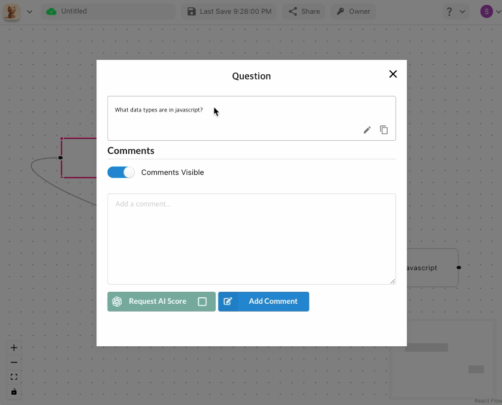

# 배경

이전에 질문과 답변을 정리해서 하나의 마인드맵으로 만들고, 꼬리질문을 시각화 하면서

해당 답변에 대한 AI 평가 점수를 받는 플랫폼을 간단하게 개발했었습니다.

간단한 움짤로 보면 다음과 같습니다.



진행하던 도중 몇가지 고민한 내용을 다루어 보려고 합니다.

해당 서비스의 자료구조는 하나의 "플로우" 라는 상위개념 안에 "노드"와 "엣지" 가 존재하는 일종의 tree 형태입니다.

예를 들어, 각 노드에는 질문에 대한 내용, 답변, 그리고 댓글 등이 존재할 수 있습니다.

간소화시킨 JSON 형태는 다음과 같을 수 있습니다

```json
{
  "nodes": [
    {
      "id": "node1",
      "type": "question",
      "data": {
        "label": "Q1",
        "question": "What is your name?",
        "answers": ["Alice", "Bob", "Other"],
        "comments": []
      },
      "position": { "x": 100, "y": 150 },
      "width": 200,
      "height": 100,
      "selected": false,
      "dragging": false,
      "resizing": false
    }
    // ...
  ],
  "edges": [
    { "id": "edge1", "source": "node1", "target": "node2", "type": "default" }
    // ...
  ],
  "viewport": { "zoom": 1.0, "x": 0, "y": 0 }
}
```

그리고 이 객체는 RDBMS를 사용한다면 다음과 같이 저장될 것입니다.

```sql
CREATE TABLE flows (
    flow_id      BINARY(16) PRIMARY KEY,
    member_id    BINARY(16),
    flow_title   VARCHAR(255) NOT NULL,
    created_at   TIMESTAMP(6) NOT NULL,
    updated_at   TIMESTAMP(6) NOT NULL,

    flow_content JSON NOT NULL,  -- ?? >
);
```

대부분의 경우 BLOB 또는 JSON 칼럼을 RDBMS에 넣는것은 기피됩니다.
