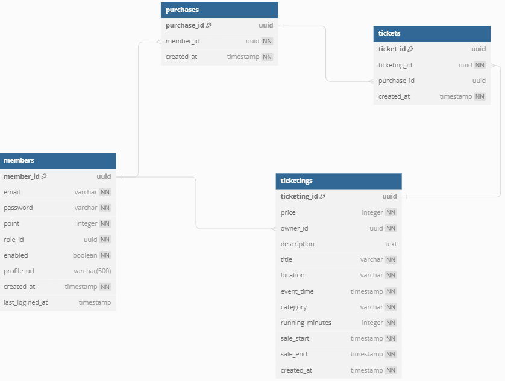
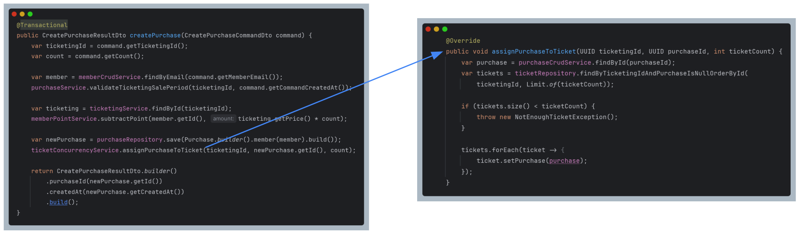
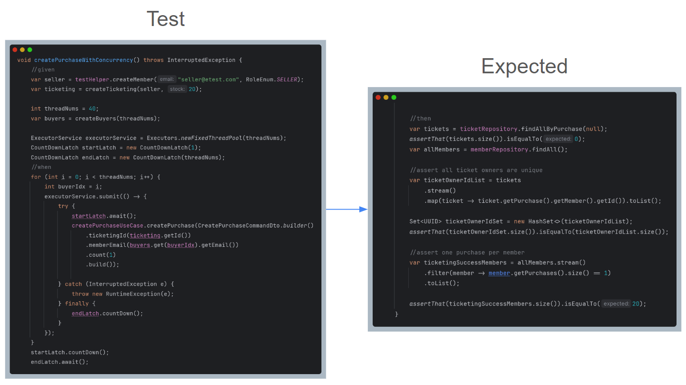
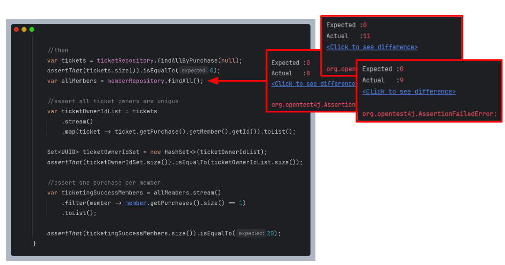
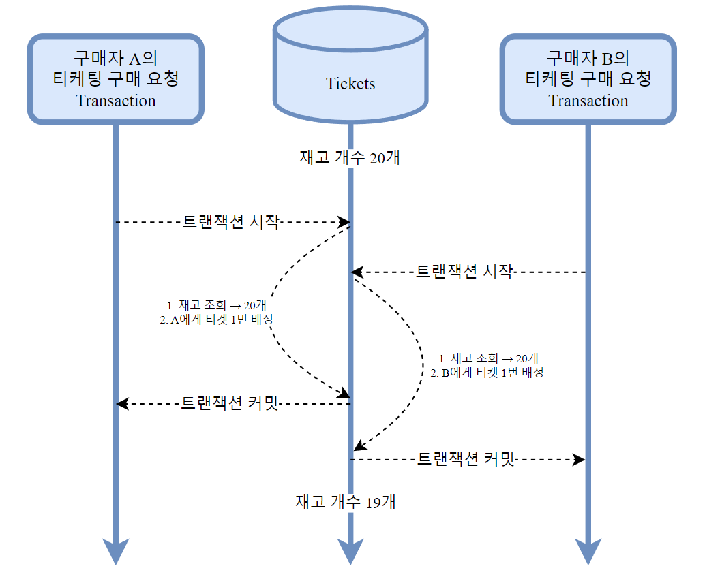
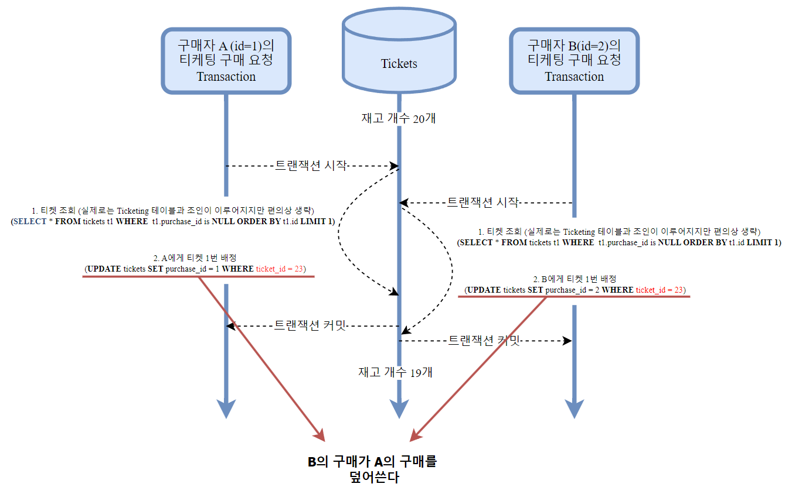

# 개요

### 동시성

> 여러개의 스레드 또는 프로세스가 동일한 자원에 접근하거나 수정할 때 발생하는 문제

이번 아티클에서는 티케팅 시스템에서 여러 사용자가 한정된 수량에 대해 동시에 구매를 요청했을 때
발생할 수 있는 **동시성 문제**에 대해서 다루도록 하겠습니다.

> 글에서 언급되는 모든 코드는 [Tiketeer-BE](https://github.com/Tiketeer/Tiketeer-BE) 에서 원본을 확인하실 수 있습니다.

참고용 ERD

### 티켓 구매

사용자가 티켓을 사는 Use case는 다음과 같습니다.

1. TicketRepository에서 특정 티케팅에 소속되어있으면서 아직 **구매되지 않은** 티켓들을 조회합니다.
2. 만약 남아있는 티켓 수가 구매하려는 티켓의 수보다 **적다면** 예외가 발생합니다.
3. **충분한** 티켓이 남아있자면 조회된 티켓들에게 구매자를 할당합니다.

# 상황

실제 테스트 코드와 다이어그램을 통해서 설명해 보겠습니다

### 시나리오

40명의 구매자가 총 20개 티켓에 대해서 동시에 구매 요청을 전송합니다.

기대되는 올바른 결과는 다음과 같습니다 :

1. 20개의 티켓은 모두 소진, 서로 다른 구매자에게 배정
2. 20명의 구매자는 성공적으로 티켓을 구매
3. 나머지 20명의 구매자는 티켓 구매 실패

다음과 같은 코드를 통해 테스트를 수행하였습니다.

### 테스트 결과

이미지에서도 확인할 수 있듯이, 구매가 되지 않은 티켓의 총 개수는 0개가 아닌 값으로 나타납니다.

즉 20개보다 적은 티켓으로 40명의 구매자가 구매에 성공했다는 것입니다 (오병이어?)

심지어 여러번 테스트 했을 때 **매번 다른 결과값**이 나오는것을 볼 수 있습니다.

이 결과는 동시성 문제를 의심해볼 수 있습니다.

# 고찰

해당 문제의 원인은 트랜잭션의 공유자원 접근으로 인해 일어납니다.

실제 요약된 SQL과 함께 살펴보면 다음과 같습니다

### 뭐야 제 티켓 돌려줘요 - Lost Update

이처럼 두 트랜잭션이 동일한 자원에 접근할 때, 하나의 트랜잭션이 다른 트랜잭션의 결과를 덮어써서 하나의 트랜잭션의 결과가 유실되는것을 **Lost Update**라고 합니다.

트랜잭션이 커밋되기 전 다른 트랜잭션이 해당 값을 읽게 되기 때문에 해당 문제는 발생합니다.

# 해결

해당 문제를 해결하는 방법들에 대해서 별도의 아티클로 다루고 있습니다.

### Optimistic Locking

### Pessimistic Locking

### Distributed Locking
