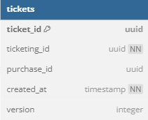
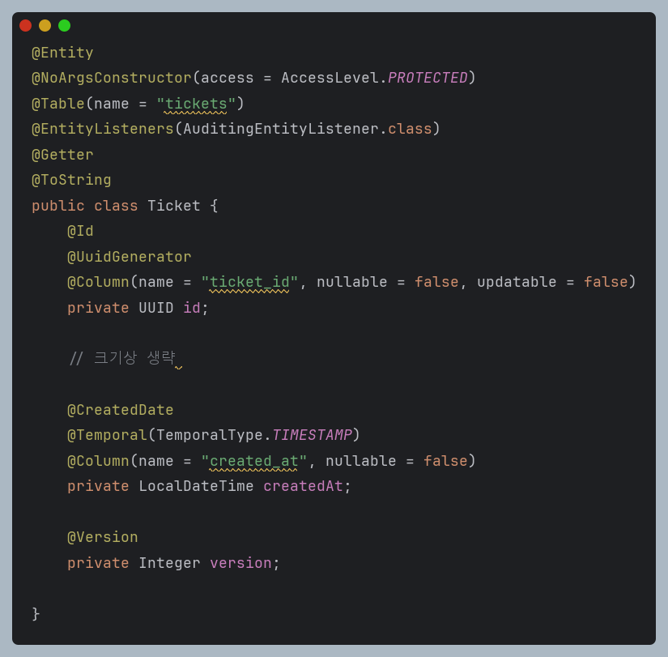
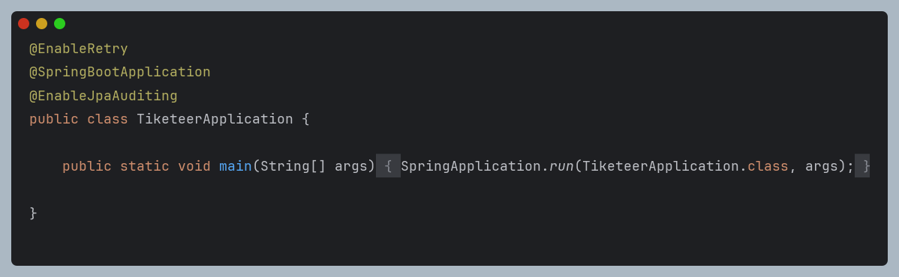
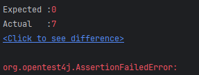
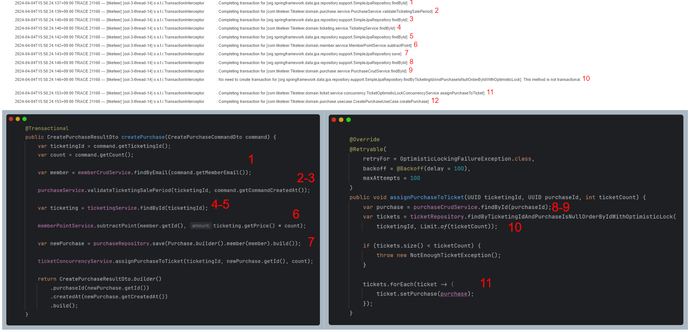

# Introduction

## Overview

This is the solution part of the topic covered in the previous article, [Causes of Concurrency Issues in Ticketing Systems](https://www.notion.so/27167ab086ac49b482e9e25a58dd3f79?pvs=21).

In this post, we will look at how to resolve concurrency issues using optimistic locking.

# Main Content

## Theory

Before applying optimistic locking, let's briefly review how optimistic locking can address concurrency issues.

Returning to the problem scenario, it is as follows:


### Optimistic Locking

Optimistic locking resolves concurrency issues by adding a version column.

{:style="display:block; margin-left:auto; margin-right:auto"}

Before writing any code, let’s see how the version column helps resolve concurrency issues.


### Transactions

Transactions proceed in two steps:

1. Query the ticket that has not yet been purchased.
2. Assign an owner to the ticket.

### Transaction A Entry

1. Transaction A starts and retrieves the stock along with the version column.
2. Since the version value at retrieval matches the version value to update, A assigns an owner to the ticket and increments the version by 1.

### Transaction B Entry

1. Transaction B started before step A-2. The version column value retrieved is the same as in A-1, which is 1.
2. B finds that the version at retrieval (1) differs from the intended update value (2).
3. It throws an exception. This exception must be handled by the developer at the application level.

## Code

### Adding a Version Column

You can use types like Timestamp or HashCode for the version column.
In this case, we used Integer.



Query changes:


### @Retryable

As mentioned earlier, in case of an `OptimisticLockingFailureException`, a retry must be performed.

Spring supports the `@Retryable` annotation, which helps perform retries at the method level via AOP.

To use it, you first need to add the following dependencies to your build.gradle file:

```yaml
implementation("org.springframework.retry:spring-retry")
implementation("org.springframework:spring-aspects")
```

Next, add the `@EnableRetry` annotation at the application level to enable AOP.



Then, add the `@Retryable` annotation to the method you want to enable retries for.

Among the annotation arguments, `value` is deprecated, so you should specify the error to catch using `retryFor`.

The retry interval is set using `backoff`.

The maximum number of attempts is set using `maxAttempts`.


### Failure

After all preparations, I ran the tests. 

It failed for some reason.

Checking the logs to find the reason, I saw that the `OptimisticLockingFailureException` that was supposed to be caught by Retry was not being caught by try-catch.


Tracing the flow manually using thread-14 as a reference, I confirmed that all methods were executing normally.



# Solution…?

Thinking about why the exception was thrown after all methods had completed, I realized that the error actually occurs at the **transaction commit time**.

In other words, I concluded that the problem occurs at the point when the persistence context is synchronized with the actual database.

If this hypothesis is correct, it explains why the exception occurs after createPurchase ends and why assignPurchaseToTicket can’t catch it.

Therefore, to align the timing of synchronization, I used the flush method as shown below, and confirmed that the test passed.


# To be continued….

However, even at this point, there was still a problem I hadn’t considered…

I will continue in the next post.
