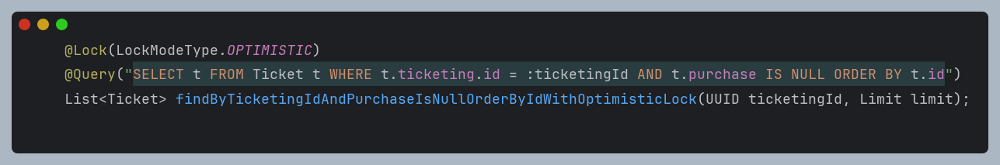

# 서론

## 개요

이전 [티케팅 시스템의 동시성 문제 : 원인편](https://www.notion.so/27167ab086ac49b482e9e25a58dd3f79?pvs=21) 에서 다룬 내용의 해결편입니다.

이번 글에서는 동시성 문제를 낙관적 락을 통해 해결하는 방법을 알아보도록 하겠습니다.

# 본론

## 이론

우선 낙관적 락을 적용하기 전, 낙관적 락이 어떤 방식으로 동시성 문제를 해결할 수 있는지 살펴보도록 하겠습니다.

다시 문제상황을 돌아보면 아래와 같습니다.


### 낙관적 락

낙관적 락은 version 칼럼을 추가하여 동시성 문제를 해결합니다.

{:style="display:block; margin-left:auto; margin-right:auto"}

코드로 작성하기 전, 어떻게 version 칼럼이 동시성 문제를 해결하는지 살펴보겠습니다.


### 트랜잭션

트랜잭션은 두 단계로 진행됩니다

1. 구매가 되지 않은 티켓을 조회합니다
2. 티켓에 소유자를 지정합니다 

### A의 트랜잭션 입장

1. A의 트랜잭션이 시작되고, 재고를 가져올 때 version 칼럼 정보도 함께 조회합니다.
2. A는 조회한 version 값과 update를 원하는 version 값이 일치하기 때문에 조회한 티켓에 소유자를 지정하고, version 값을 1 증가시킵니다.

### B의 트랜잭션 입장

1. B의 트랜잭션은 A-2 이전에 시작되었습니다. 조회한 version 칼럼 정보는 A-1과 동일하게 1입니다.
2. B는 조회 시점의 version은 1과 업데이트를 하려는 값은 2로 달라졌다는것을 확인합니다
3. 예외를 발생시킵니다. 해당 예외는 애플리케이션 레벨에서 개발자가 처리해야 합니다.

## 코드

### Version 칼럼 추가

Timestamp, HashCode등의 타입을 사용하여 Version 칼럼을 추가할 수 있습니다.
이번에는 Integer 타입을 사용하였습니다.


쿼리 변경



### @Retryable

앞서 언급한 바와 같이 OptimisticLockingFailureException 발생으로 인해 실패하는 경우, 재시도를 수행해야 합니다. 

스프링에서는 AOP를 통해 메소드 단위로 재시도를 도와주는 @Retryable 애노테이션을 지원하고 있습니다.

사용하기 위해서는 먼저 build.gradle 파일에 아래 의존성을 추가해야 합니다. 

```yaml
	implementation("org.springframework.retry:spring-retry")
	implementation("org.springframework:spring-aspects")
```

다음으로 AOP를 위해 애플리케이션 단위 @EnableRetry 애노테이션을 추가해줍니다.


재시도를 원하는 메소드에 @Retryable 애노테이션을 추가합니다

애노테이션 인자 중 `value`는 deprecated 되었기 때문에 `retryFor`를 사용해 잡고자 하는 에러를 명시합니다.

재시도 간격은 `backoff`로 설정합니다.

최대 수행 횟수는 `maxAttempts`로 설정합니다.


### 실패

만반의 준비를 마치고 테스트를 돌렸습니다.


왜인지 실패하였습니다.

이유를 찾기 위해 로그를 확인한 결과 Retry로 잡혀야 하는 `OptimisticLockingFailureException` try - catch를 통해 잡히지 않는 것을 확인하였습니다.


임의로 thread-14를 기준으로 흐름을 따라가본 결과, 모든 메소드들이 정상적으로 실행되었다는것을 확인하였습니다.


# 해결…?

모든 메소드가 종료된 이후에 Exception이 종료된 이유를 생각해본 결과, 실제로 에러가 터지는 시점은 **트랜잭션 커밋 시점**이라고 생각하였습니다.

즉, 영속성 컨텍스트와 실제 데이터베이스를 동기화시켜주는 시점에서 해당 문제가 발생하는것이라고 판단하였습니다.

이 가설대로라면 실제로 예외가 발생하는 시점은 createPurchase의 종료 이후이기 때문에 assignPurchaseToTicket 내부에서 잡지 못하는게 설명됩니다.

따라서 동기화를 시켜주는 시점을 일치시켜주기 위해서 아래와 같이 flush 메소드를 사용하였고, 테스트를 통과하는것을 확인하였습니다.


# To be continued….

하지만 이 시점까지도 고려하지 못한 문제가 있었는데…

다음 포스팅에서 이어보겠습니다