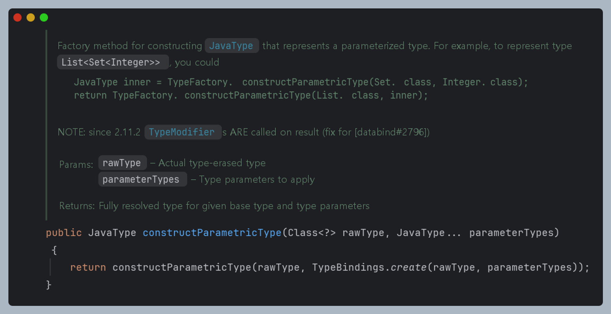

# 서론

RestController를 MockMvc를 사용하여 테스트를 진행할 때 JSON 결과값을 예상한 값과 비교해야 합니다.

이때는 일반적으로 jsonPath를 사용하여 객체의 모든 값들을 검증하게 됩니다.

```java
//when - then

		mockMvc.perform(get("/api/members/" + member.getId() + "/sale")
				.contextPath("/api")
				.with(csrf())
				.contentType(MediaType.APPLICATION_JSON)
				.characterEncoding("utf-8")
				.cookie(cookie)
			)
			.andExpect(status().isOk())
			.andExpect(jsonPath("$.data").isArray())
			.andExpect(jsonPath("$.data[0].price").value(1000))
			.andExpect(jsonPath("$.data[0].description").value(""))
			.andExpect(jsonPath("$.data[0].title").value("test"))
			.andExpect(jsonPath("$.data[0].location").value("Seoul"))
			.andExpect(jsonPath("$.data[0].eventTime").value(now.toString()))
			.andExpect(jsonPath("$.data[0].saleStart").value(now.toString()))
			.andExpect(jsonPath("$.data[0].saleEnd").value(now.toString()))
			.andExpect(jsonPath("$.data[0].stock").value(3))
			.andExpect(jsonPath("$.data[0].remainStock").value(1))
			.andExpect(jsonPath("$.data[0].category").value(""))
			.andExpect(jsonPath("$.data[0].runningMinutes").value(600));
```

jsonPath를 사용한 수동 값 검증은 json 구조가 복잡하지 않을 경우에는 편리하지만, 

객체의 속성들이 많아지고 배열 등이 섞이게 되면 jsonPath가 문자열을 인자로 받는 특성상, IDE의 도움을 

받을 수 없어 놓치거나 오타가 들어가는 등 불편함을 느끼게 되었습니다. 

그러던 중 TypeScript의 경우, JSON.parse 메소드를 사용하면 쉽게 json 문자열을 객체로 변환하는것이 가능했는데,

라는 생각을 하게 되었습니다

```java
const jsonString = '{"name": "John", "age": 30, "city": "New York"}';

interface Person {
  name: string;
  age: number;
  city: string;
}

const person: Person = JSON.parse(jsonString);
```

# 본론

저희 Tiketeer 프로젝트에서는 API 응답 객체를 설계할 때 별도의 래퍼 클래스를 활용하고 있습니다.

```java

@Getter
@ToString
@NoArgsConstructor(force = true)
public class ApiResponse<T> {
	private final T data;

	private ApiResponse(T data) {
		this.data = data;
	}

	public static <T> ApiResponse<T> wrap(T data) {
		return new ApiResponse<>(data);
	}
}
```

저희는 해당 래퍼 클래스를 활용하여 

1. 단일 객체 DTO
2. 배열 DTO (ex: `TicketingResponse[]` 와 같이 배열을 반환해야 하는경우)

를 생성해주고 있습니다.

각 종류에 대해서 어떻게 역직렬화를 하고 있는지 설명드리도록 하겠습니다.
### 단일 객체 DTO

비슷한 고민을 한 사람들이 많았는지, 대표적인 직렬화/역직렬화 라이브러리인 Jackson에서는 이미

ObjectMapper 클래스 내부에 readValue라는 메소드를 제공합니다.

```java
public <T> T readValue(String content, JavaType valueType)
```

아쉽게도, 클래스가 아닌 JavaType을 두번째 인자로 제공해야 합니다.

따라서 클래스를 인자로 받아 JavaType을 반환하는 메소드를 하나 작성하도록 하겠습니다.

```java
private JavaType getApiResponseType(Class<?> clazz) {
		return objectMapper.getTypeFactory().constructParametricType(ApiResponse.class, clazz);
	}
```

두 메소드를 활용하면 아래와 같이 역직렬화 메소드를 만들 수 있습니다. 

```java

	public <T> ApiResponse<T> getDeserializedApiResponse(String json, Class<T> responseType) throws
		JsonProcessingException {
		return objectMapper.readValue(json, getApiResponseType(responseType));
	}
```

### 리스트 형태 DTO

단일 객체가 아닌 리스트 형태의 반환타입은 아래와 같이 메소드를 작성할 수 있습니다. 

`List<TargetType>` 의 형태를 반환할 때, 최종 목표는 `List<TargetType>` 의 JavaType 객체를 구하는 것입니다.

다행히 `ObjectMapper` 클래스의 `TypeFactory`는 `constructParametricType` 메소드가 오버로딩 되어있습니다.

{: width="500" }

해당 메소드를 활용하면, List 클래스의 JavaType만 있으면 마찬가지로 `List<TargetType>`의 JavaType을 얻을 수 있습니다.

```java
private JavaType getApiResponseType(Class<?> clazz) {
	return objectMapper.getTypeFactory().constructParametricType(ApiResponse.class, clazz);
}

// 단일 객체역직렬화에서 사용한 메소드를 overloading

private JavaType getApiResponseType(JavaType javaType) {
	return objectMapper.getTypeFactory().constructParametricType(ApiResponse.class, javaType);
}

private JavaType getListApiResponseType(Class<?> clazz) {
	JavaType listType = getListType(clazz);
	return getApiResponseType(listType);
}
```

이제 List 클래스에 대한 JavaType을 구하는 일만 남았습니다. 

```java

	private JavaType getListType(Class<?> clazz) {
	return objectMapper.getTypeFactory().constructParametricType(List.class, clazz);
}
```

모두 합치면 다음 메소드를 작성할 수 있습니다. 

```java
public <T> ApiResponse<List<T>> getDeserializedListApiResponse(String json, Class<T> responseType) 
	throws
	JsonProcessingException {
	return objectMapper.readValue(json, getListApiResponseType(responseType));
}
```

저희는 작성한 메소드들을 테스트코드에서 반복적으로 이루어지는 작업 (데이터베이스의 테이블 초기화 등) 을 담당하는 

TestHelper 클래스 내부에 배치시켰습니다.

실제 사용 예시는 다음과 같습니다. 

```java
	//when - then
	MvcResult result = mockMvc.perform(get("/api/members/" + member.getId() + "/sale")
			.contextPath("/api")
			.with(csrf())
			.contentType(MediaType.APPLICATION_JSON)
			.characterEncoding("utf-8")
			.cookie(cookie)
		)
		.andExpect(status().isOk())
		.andReturn();

	String jsonResult = result.getResponse().getContentAsString();

	ApiResponse<List<GetMemberTicketingSalesResponseDto>> apiResponse = 
		testHelper.getDeserializedListApiResponse(
		jsonResult, GetMemberTicketingSalesResponseDto.class);

	var dto = apiResponse.getData().getFirst();

	assertThat(dto.getPrice()).isEqualTo(1000);
	assertThat(dto.getDescription()).isEqualTo("");
	assertThat(dto.getTitle()).isEqualTo("test");
	assertThat(dto.getLocation()).isEqualTo("Seoul");
	assertThat(dto.getEventTime()).isEqualToIgnoringNanos(now);
	assertThat(dto.getSaleStart()).isEqualToIgnoringNanos(now);
	assertThat(dto.getSaleEnd()).isEqualToIgnoringNanos(now);
	assertThat(dto.getStock()).isEqualTo(3);
	assertThat(dto.getRemainStock()).isEqualTo(1);
	assertThat(dto.getCategory()).isEqualTo("");
	assertThat(dto.getRunningMinutes()).isEqualTo(600);
```

### 이점

해당 방식으로 JSON값을 객체로 역직렬화한다면 추가적인 이점 또한 존재합니다. 

바로 DateTime등 시간 객체에서 제공하는 메소드들을 활용할 수 있다는 것인데요.

객체를 직렬화/역직렬화 하는 과정에서 시간값의 자리수가 유실되거나, 나노초 단위에서 0 padding이 추가되는 경우가 존재합니다.

하지만 기존 JsonPath 방식의 경우, 문자열 직접 비교를 하기 때문에 이러한 차이를 매번 잡아주기 어렵습니다.

이때 `isEqualToIgnoringNanos`와 같은 메소드를 활용하면 더 편리하고 정확하게 테스트 코드를 작성할 수 있습니다.

# 결론

이번 글에서는 테스트코드에서 객체 역직렬화를 달성하는 방법을 알아보았습니다.

속성이 많아 복잡하거나 초단위까지 포함된 시간값이 포함된 DTO의 경우 해당 방식을 이용하여 편리하게

테스트 코드를 작성할 수 있었다고 생각합니다.

실제 [코드](https://github.com/Tiketeer/Tiketeer-BE/blob/develop/src/test/java/com/tiketeer/Tiketeer/testhelper/TestHelper.java) 및 [레포지토리](https://github.com/Tiketeer/Tiketeer-BE)

감사합니다.