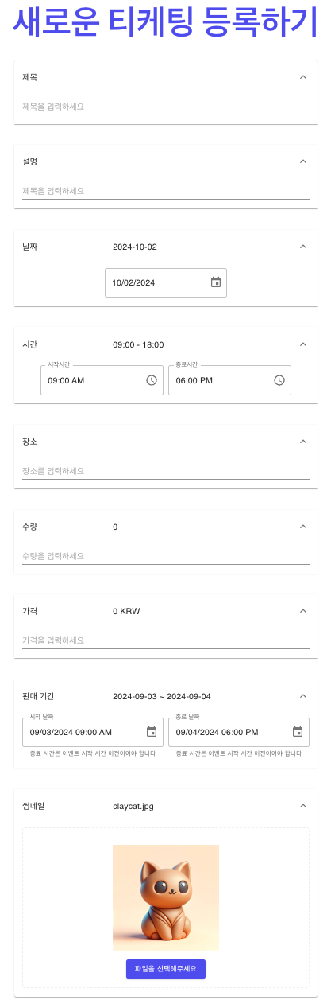

# 서론

최근 진행하는 티켓 예매 서비스 프로젝트인 Tiketeer는 

판매자가 자신이 주최하는 행사의 예매 시작일, 장소, 수량 등과 함께 행사의 썸네일을 입력할 수 있습니다.

<details><summary>실제 UI[펼치기]</summary><div markdown="1">

</div></details>
  
  &nbsp;

썸네일 사진을 입력받는 전략들은 다양하게 존재합니다.

직접 **로컬 파일 스토리지**에 저장하거나, base64 인코딩 후 **데이터베이스**에 저장하는것 또한 가능하며

이를 섞어 **파일 경로**만을 데이터베이스에 저장하는 방식 또한 존재합니다. 

또한 외부 **AWS S3** Object Storage 기능을 활용할 수도 있으며, **SeaweedFS**등의 솔루션 또한 존재합니다.

이렇게 다양한 옵션들을 하나의 인터페이스로 통합하여 확장성 있는 썸네일 저장 전략을 구현하고, 

비동기 처리를 통해 개선한 과정을 소개드리고자 합니다. 

모든 코드는 [🔗레포지토리](https://github.com/Tiketeer/Tiketeer-BE) 에서 확인할 수 있습니다. 

# 본론

## 기존 파일 처리 방식

기존 파일 처리방식을 간단하게 살펴보면 다음과 같습니다.

먼저 Multipart 파일을 티켓팅의 다른 속성들과 함께 JSON 페이로드로 전달받습니다.

전달받은 파일은 서비스 레이어에서 처리됩니다.

[🔗컨트롤러 & 서비스 레이어 코드 요약 GIST 링크](https://gist.github.com/claycat/a31e190c7efa2a9075465e7a26639667)

이후 실제 파일을 처리하는 로직은 

로컬에 파일을 저장 방식의 구현체인 LocalFileStorage 클래스를 사용하거나

외부 AWS S3 서비스의 구현체인 S3Service를 사용하여 처리합니다 

[🔗AWS S3 서비스 구현체 & 로컬 파일 저장 구현체 GIST 링크](https://gist.github.com/claycat/e9af75178f494facf9fdae687d266cb1)

간단하게 다이어그램으로 살펴보면 다음과 같습니다


## 문제점

### 성능

굳이 파일이 저장되는것을 기다린 후 반환해야 할까? 라는 의문이 들었습니다.

결국 파일의 접근자만 제공한다면 이미지 접근 링크를 미리 제공하고, 저장 자체는 비동기로 수행해도 된다는 생각이 들었습니다.

파일 서비스의 독립성을 위해서 서버를 분리한 아키텍처입니다


### 추상화

기존의 두가지 파일 처리 방식은

1. 파일을 업로드 
2. 파일에 접근할 수 있는 경로 제공

이라는 동일한 추상화로 엮을 수 있음에도 불구하고 서로 다른 사용방식을 갖고 있습니다.

만약 로컬 파일 저장 방식을 사용하다 S3 방식으로 바꿔야 할 필요성이 생길 경우, 코드의 수정 및 재배포가 일어나야 합니다.

또한, 새로운 구현체에 대한 확장 또한 까다롭습니다.

그렇기 때문에 하나의 인터페이스를 통한 추상화의 필요성을 느끼게 되었습니다.
 
## 초기 구상

추상화에 대한 초기 구상은 다음과 같았습니다 


파일 저장 전략 객체를 추상화하여 업로드와 접근 모두 동일한 인터페이스를 통해서 접근하고자 하였습니다.

## 문제점

하지만 이 전략은 문제점이 존재했습니다. 

파일 리소스에 접근할 때, S3의 경우 AWS로부터 이미지 데이터를 읽어와 Flux<DataBuffer>를 반환하는것은 비효율적이라는 생각이 들었습니다.

네트워크 통신비용 및 DataBuffer 스트림의 재조합 비용으로 인해 배보다 배꼽이 크기 때문입니다.  

처음에는 추상화 계층을 더 확장하는 방안을 생각하였습니다.

```kotlin
interface FileStorageStrategy {
    fun uploadFile(file: StorageFile): Mono<String>
    fun uploadFiles(files: List<StorageFile>): Flux<String>
    fun retrieveFile(fileId: String): Mono<ResponseEntity<out Any>>
}
```
전략객체의 반환값으로 ResponseEntity를 생성하고, 컨트롤러에서 아무 가공 없이 직접 반환해주는 방식입니다.

하지만 이 방식은 파일 저장 전략객체가 컨트롤러의 책임을 침범하고, 레이어간 구분이 의미가 없어지는 문제가 있다고 생각하였습니다.

결국 처음 생각한 추상화는 지나친 일반화로 인해서 실패했다고 판단하여, 더 잘게 쪼개는 접근을 시도하였습니다.

새롭게 고려해야 하는 요구사항은 다음과 같습니다:
* **AWS의 경우에는 직접 URL을 서빙하고, 로컬 파일 전략인경우에는 별도로 컨트롤러에서 접근 API를 제공해야 합니다.**


인터페이스 분리 원칙을 생각하여, 과감하게 업로드 인터페이스와 회수 인터페이스를 분리하였습니다

### 상속보다 합성을 우선하라

한가지 눈여겨볼 점은 LocalFileStorageStrategy와 LocalFileRetrieveUseCase가 둘 다 LocalFileSystemUtil에 의존한다는 점입니다.

LocalFileSystemUtil의 기능을 갖는 LocalFileStorage 라는 추상 클래스를 생성하고 LocalFileStorageStrategy와 LocalFileRetrieveUseCase가 상속받아도 되지만,

결합도가 높아지고 클래스 폭발 문제를 유발할 수 있는 상속보다는 합성을 선택하였습니다.


# 결론

## 주의점

객체지향을 통한 확장성 확보와 비동기를 통한 성능 성능 향상에 대해서 알아보았습니다.

전체적인 지식 습득에는 좋은 경험이었지만, 실제 업무상황이라면 굳이 이렇게 토끼굴을 파야 하나? 라는 생각 또한 들게 되었습니다.

이유는 몇가지가 있습니다.

1. 트레이드오프
    * Reactive Kotlin을 사용하여 S3 이미지 업로드를 수행하는 예시를 찾을 수 없어 많은 시간이 할애되었습니다.
    * Reactor Flow에 대한 이해도가 부족하여 디버깅에 어려움이 있었습니다.
2. 성능개선 필요성에 대한 고민
    * 티켓팅을 등록하는 과정 자체는 자주 일어나는 상황이 아닙니다.  
    * 또한 등록되는 썸네일 또한 굳이 성능적 중요도가 큰 항목이 아닙니다.  
    * 썸네일의 용량이 크거나 부하를 줄만큼 개수가 많지 않습니다.
      

비동기로 인해서 성능적 개선을 이룬것은 좋지만 이 역시도 주의점이 숨어있습니다.

1. 만약 실패한다면?
   * 실패 케이스를 항상 고려해야 합니다.
     * 메시지 큐 또는 모종의 모니터링/로그 시스템을 통해서 실패했을 때 회수 가능해야 합니다.

항상 강조하지만, 엔지니어링은 트레이드오프를 고려한 선택의 연속이라고 생각합니다.  

개발 또한 업무라면 여기서 벗어나면 안된다고 생각합니다.  

매몰비용이 아깝더라도 데드라인과 현재 리소스 등을 고려한 판단이 중요하다고 생각합니다.

---

## 참고자료

https://www.earlgrey02.com/post/21
