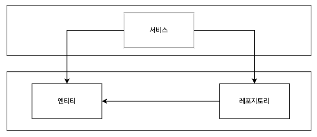

| "만들면서 배우는 클린 아키텍처"를 읽으며 개인적으로 정리한 내용입니다.

웹 어플리케이션 개발에 처음 입문했을 때, Controller - Service - Repository 구조로 이어지는 클래식한 아키텍처를 많이 사용하였습니다.



책을 읽으면서 프로젝트의 규모가 커지면서 느꼈던 계층형 아키텍처의 문제에 대해서 생각해볼 수 있었습니다.  

## 비대한 서비스 레이어와 애매한 유즈케이스

간단한 게시판 프로젝트를 예시로 들겠습니다.

계층형 아키텍처를 선택했다면 게시판 프로젝트의 코드를 상상하라고 했을 때, 전형적인 PostService 서비스 객체를 떠올리게 됩니다.  

```java
@Service
class PostService {
    // 각종 레포지토리 DI

    public void CreatePost(dto);
    public void DeletePost(dto);
    public void UpdatePost(dto)
    ...
}
```

간단한 CRUD 서비스에서는 체감이 되지 않았지만,

유즈케이스가 많아질수록 PostService라는 서비스 레이어의 역할은 어디까지인지, 어떻게 구분해야 하는지 어려웠습니다.

Post 도메인과 관계가 있다는 이유만으로 계속해서 PostService에 메소드를 추가한 결과, 비대한 Post 서비스 코드가 생성되고  

PostController와 PostService는 1:1 대응을 하는 경우도 있었습니다.

이를 피해서 모든 유즈케이스를 별도의 Service로 생성해도 

