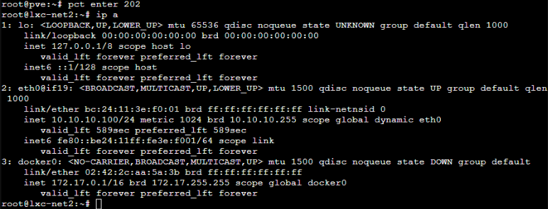
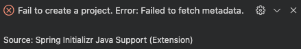
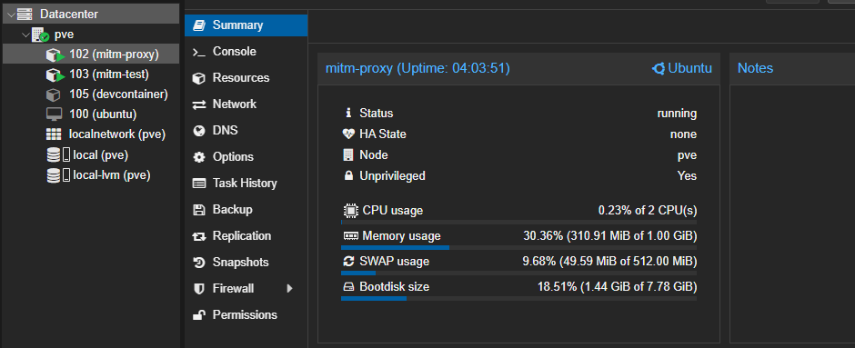
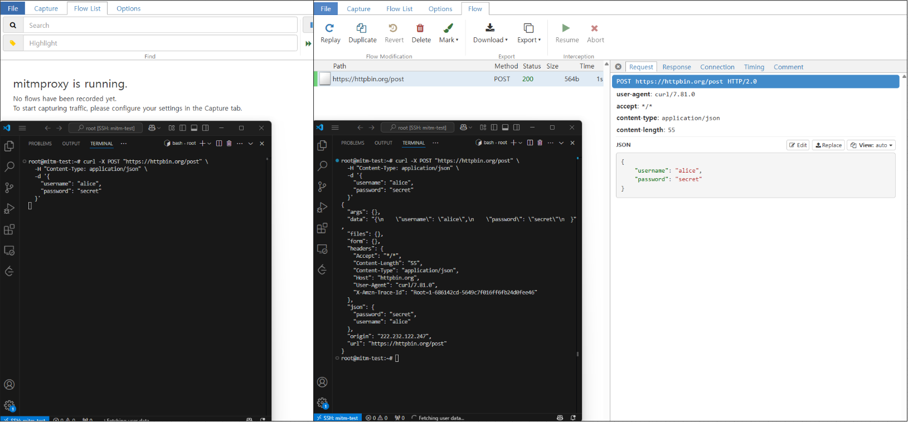

최근에 회사에서 새 프로젝트를 생성하려고 Spring Initializr VSCode Extension을 사용하였습니다.

별다른 문제 없이 진행될 줄 알았는데, 예상치 못하게 PKIX path building failed 오류가 발생하며 프로젝트 생성이 실패하였습니다.

<!--  -->

```
 PKIX path building failed: sun.security.provider.certpath.SunCertPathBuilderException...
```



[찾아보니](https://stackoverflow.com/questions/50764343/spring-tool-suite-suncertpathbuilderexception-unable-to-find-valid-certificati) 비슷한 문제를 겪은 사람을 볼 수 있었고, 에러명으로부터 유추했을 때 인증서 + 프록시의 복합적인 문제라고 예상하였습니다.

자체적으로 네트워크를 운영하는 회사망에서 발생하는 문제라고 단순하게 생각하고 넘어갈 수 있겠지만,

왜 이런 현상이 발생하는지 조금 더 정확하게 이해하고 싶었습니다.

문제를 재현해보면서 HTTPS 통신이 어떻게 이루어지는지, 인증서와 신뢰 체계가 어떤 원리로 동작하는지 하나씩 확인해보려고 합니다.

# HTTPS

## HTTP

HTTP는 데이터를 암호화하지 않고 그대로 주고받는 프로토콜입니다.

즉, 네트워크 구간에서 누군가 트래픽을 가로채면 요청과 응답의 내용을 그대로 볼 수 있습니다.

HTTPS는 이런 문제를 해결하기 위해 HTTP 위에 SSL/TLS 계층을 더한 방식입니다.

같은 요청이라도 암호화된 형태로 전송되어, 중간에서 데이터를 훔쳐보거나 변조할 수 없게 구성됩니다.

잠깐 TLS와 SSL에 대해서 이야기하자면, 처음에는 SSL(Secure Sockets Layer)이라는 용어가 쓰였지만, 이후 표준화가 진행되면서 TLS(Transport Layer Security)로 명칭이 바뀌었습니다.

크게 세 단계로 동작하며, 다음과 같습니다.

1. 핸드셰이크(Handshake)

- 통신을 시작하기 전에 서로 어떤 암호화 알고리즘을 쓸지 협상하고, 인증서를 교환합니다.

2. 세션키 생성

- 클라이언트와 서버가 대칭키를 안전하게 생성하여 공유합니다.
  - 서버의 공개키로 클라이언트 대칭키를 암호화한 후 전송합니다.

1. 데이터 송수신

- 실제 데이터는 이 대칭키로 암호화해 교환합니다.

다만, 서버가 "내 공개키가 진짜야" 라고 해서는 신뢰할 수 없기 때문에 PKI(Public Key Infrastructure) 체계가 사용됩니다.

- **인증서(Certificate)**는 서버의 공개키에 서버 식별 정보(도메인명 등)를 결합하고, 신뢰할 수 있는 제3자(CA, Certificate Authority)가 디지털 서명을 한 문서입니다.

- 클라이언트(브라우저나 프로그램)는 서버의 인증서를 받으면 CA의 서명을 검증합니다.

- CA의 공개키는 이미 OS나 브라우저에 사전에 등록되어 있기 때문에, 이 과정을 통해 신뢰 여부를 확인할 수 있습니다.

따라서 이 과정에서 만약 인증서가 유효하지 않거나, 신뢰할 수 없는 CA가 서명했거나, 도메인이 일치하지 않는다면 연결이 차단되거나 경고가 뜨게 됩니다.

# 회사에서 HTTPS를 어떻게 활용하는지

회사 네트워크에서는 외부 HTTPS 트래픽을 단순히 그대로 통과시키지 않고, 중간에서 검증하거나 로깅하기도 합니다.

이를 위해 TLS 인터셉션(TLS Interception) 혹은 SSL Proxy가 사용됩니다.

회사에서 사용하는 방식은 대략 이렇습니다.

1. 인터셉트 프록시가 트래픽을 가로챕니다.

2. 사용자가 접속을 시도하면, 프록시는 외부 서버에 TLS 세션을 맺고 별도의 TLS 세션을 내부 사용자와 맺습니다.

3. 프록시는 자체 서명된 인증서를 발급해서 사용자의 브라우저에 제공합니다.

4. 회사의 인증서가 사용자의 신뢰 목록에 미리 등록되어 있기 때문에, 브라우저나 프로그램이 이를 정상 인증서로 인식합니다.
   - 브라우저를 조작하는것과 비슷한 맥락으로, 일반적으로 두가지 방법이 존재합니다.
     1. 회사 지급 관리형 PC
        - 윈도우 그룹정책을 활용해서 회사 Root CA를 신뢰 루트 스토어에 등록
     2. 보안 프로그램 설치
        - 기업용 보안 솔루션들 (한 5개는 까는듯...)을 설치할 때, 내부 CA 인증서를 신뢰 목록에 강제로 추가합니다.

덕분에 중간에서 트래픽을 분석하거나 보안 검사를 수행할 수 있습니다.

# 그래서 왜 Spring Initializr가 실패한것인지

Spring Initializr Extension [소스코드](https://github.com/microsoft/vscode-spring-initializr/blob/main/src/Utils/index.ts#L41)를 참고하면 다음과 같이 https.get 등을 이용해 zip 파일을 내려받습니다.

결국 Node.Js HTTP 라이브러리를 경유하는것인데, NodeJS도 내부적으로 자체 CA 목록을 갖고 있기 때문입니다.

이 목록은 운영체제의 시스템 루트 CA와는 독립적으로, 브라우저와는 다른 목록을 갖게 됩니다.

따라서 `Error: unable to verify the first certificate`와 같은 에러와 함께 실패하게 됩니다.

# 확인해보자

간단하게 mitmproxy를 활용하여 테스트해보았습니다.



1. Container 102 (mitm-proxy): mitmproxy를 실행하는 게이트웨이 역할
2. Container 103 (mitm-test): 테스트용 클라이언트

참고로, mitm-test 컨테이너는 생성당시 아래와 같이 생성하여 트래픽이 102 컨테이너의 주소로 (192.168.0.20) 향하게끔 설정하였습니다.

`gw=192.168.0.20`

`--net0 name=eth0,bridge=vmbr0,ip=192.168.0.21/24,gw=192.168.0.20`

그리고, mitm-proxy 컨테이너에 IP 포워딩을 활성화시켰습니다.

`sysctl -w net.ipv4.ip_forward=1`

결과는 아래와 같았습니다.

HTTPS 통신임에도 불구하고, POST 요청의 내부를 모두 살펴볼 수 있게 되었습니다.



### HTTPS가 위험한건 아니다

일반적인 상황 (카페, 공공장소) 등에서는 문제가 발생할 이유가 없습니다.

회사처럼 특수한(모든 단말이 관리받는) 상황이 아닌 이상 어차피 단말의 인증서가 공인 CA 서명된 인증서만 취급하기 때문이죠.

만약 OS단의 CA 목록이 변조되어있다면 HTTPS를 걱정할 상황이 아닌 것입니다...

# 그럼 블라인드같은 앱도 볼 수 있는건가?

<!-- 띠껍티콘 덜덜 떠는거 -->


## 내용은 볼 수 있다.

위와 같은 상황이라면 회사 와이파이를 사용해 블라인드에 접속하여 HTTPS 통신 내용을 감시하는것은 가능합니다.

예를 들어 글 작성을 하기 위해 POST 메소드 BODY단에 글 내용을 작성하여 전송한다면, 내용을 확인할 수 있겠죠.

단, 이것은 앱이 인증서 Pinning을 사용하지 않거나, 회사 프록시를 우회하지 못하는 경우에만 가능합니다.

## "누가 썼는지"는?

이것은 또 다른 문제입니다.

회사가 네트워크 트래픽을 감시할 수 있다고 해서 곧바로 “어떤 사원이 이 요청을 보냈는지”까지 특정할 수 있는 것은 아닙니다.

예를 들어, 블라인드 앱은 사용자가 최초에 회사 이메일로 인증을 하지만, 로그인 이후에는 서버 측에서 익명화 처리가 이루어집니다.

또, 서버에 요청을 보낼 때 헤더에 세션 토큰이나 유저 식별자가 포함될 수 있으나, 회사 측에서 이를 가지고 별도로 사용자 계정과 매핑하려면 다음이 필요합니다:

- 내부 네트워크 로그 (어떤 IP가 어떤 시점에 누구의 기기였는지)

- 앱 트래픽에 포함된 세션 정보 (Authorization 헤더 등)

- 로그인 기록과의 교차 분석

그렇기 때문에 중대한 (기업 비밀 유출) 위반이 아닌 이상, 현실적으로 네트워크 기록을 통해서 작성자를 특정하는것은 어려운 문제입니다.

(오히려 실제로 특정되는 사례들은 작성자의 과거 작성글등을 통해 신상을 유추하는 경우라고 합니다)

또한, 익명성에 큰 의미를 두는 어플리케이션은 **인증서 Pinning** 이라는 기법 또한 사용합니다.

인증서 Pinning이란, “난 오직 이 서버의 정확한 공개키/인증서만 믿겠다.” 라는 마인드로

앱에 서버 인증서의 SHA256 핑거프린트나 공개키를 하드코딩합니다.

이후 앱이 TLS 핸드셰이크를 할 때, 다음 과정을 통해서 검증합니다.

1. 서버가 인증서를 보냄

2. 앱이 이 인증서의 핑거프린트를 계산

3. 내가 기억하고 있는 값과 비교

4. 다르면 연결 거부

그렇기 때문에 회사 프록시가 가짜 인증서로 중간에 가로채더라도, 핑거프린트가 다르기 때문에 앱에서 연결을 거부합니다.

대부분의 기업 프록시들은 나름 똑똑하게 작동하기 때문에, 이러한 이유로 연결이 실패하게 되면 해당 앱/사이트에 대한 도메인은

굳이 인증서 변경을 시도하지 않고 정상적으로 흐르게 둡니다.

다만, 웹사이트는 인증서 Pinning을 활용할 수 없기 때문에 가능성은 존재하게 됩니다.
