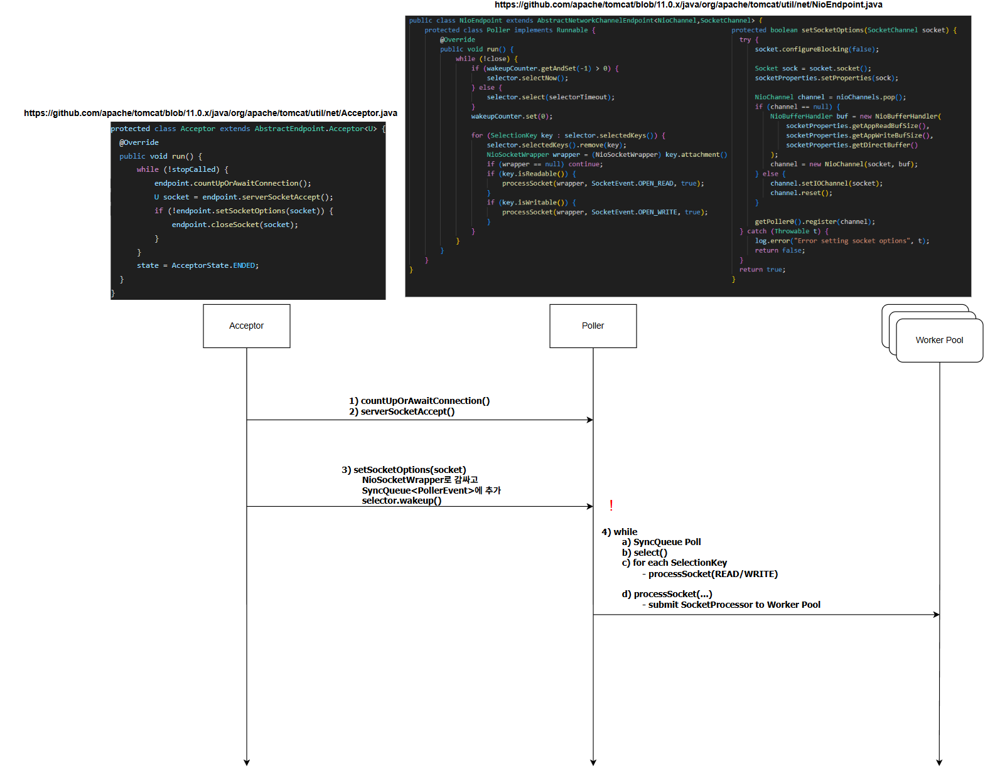
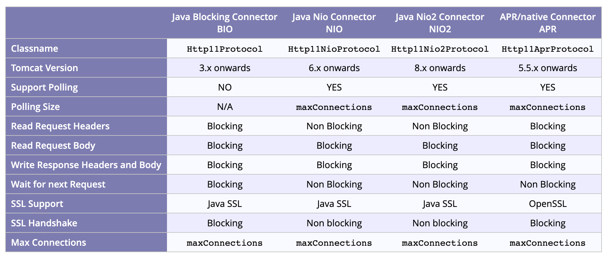

오래전에 작성했던 웹서버 포트 글에서는 왜 웹 서버가 3000번이나 8000번 같은 포트 하나만으로도 충분히 운영될 수 있는지에 대해 이야기했습니다.

하지만 당시에는 내용을 충분히 깊게 다루지 못했고, 더 깊게 파헤치고 싶었던 궁금증이 남아있어 이번 포스트에서 보다 심도 있게 다뤄보려고 합니다.

## 소켓과 파일 디스크립터(File Descriptor)

소켓(socket)에 대해 찾아보면 대부분 크게 두 가지 방식으로 설명합니다:

1. 네트워크 연결 엔드포인트의 추상화
2. 네트워크 세션을 수립하고 읽기/쓰기를 수행할 수 있는 파일 디스크립터(file descriptor)

"파일 디스크립터"이라는 개념이 좀 생소할 수 있기 때문에 간단히 설명하겠습니다.

리눅스와 같은 유닉스 기반의 운영체제는 파일을 열 때마다 시스템 내부적으로 해당 파일 자원을 가리키는 양의 정수 하나를 할당하게 됩니다.

이 숫자가 바로 **파일 디스크립터(File Descriptor, FD)**입니다.


파일 디스크립터는 생각보다 많은 곳에서 등장합니다.

가장 흔하게 애플리케이션이 커널 서비스에 접근하기 위해 호출하는 ? 에서 쉽게 발견할 수 있습니다.

```typescript
int fd = open("file.txt", O_RDONLY);
 read(fd, buf, n);
 write(fd, buf, n);
 close(fd);
```

위 코드는 파일 시스템 호출이지만, 네트워크 소켓 또한 해당 방식을 채택합니다.

```typescript
int sockfd = socket(AF_INET, SOCK_STREAM, 0);
 connect(sockfd, (struct sockaddr *)&addr, sizeof(addr));

 write(sockfd, "hello", 5);
 read(sockfd, buffer, 1024);

 close(sockfd);
```

파일을 열든, 네트워크 소켓을 열든, 파이프를 열든 리눅스는 모두 FD라는 양의 정수 하나를 사용합니다.

입출력 리소스에 대한 공통 인터페이스, 즉 추상화라고 생각해도 좋습니다.

물론 처음부터 이런 방식을 염두하고 만들어진건 아니었는데,

이는 유닉스 계열 운영체제가 처음부터 파일 기반 입출력(File I/O) 모델을 근본적으로 채택하였고,

인터페이스들은 open(), read(), write(), close()와 같이 발달하게 되었습니다.

따라서 네트워크가 추가됐을 때도 해당 인터페이스들을 그대로 활용하여 일관성을 유지할 수 있었습니다.


### 커넥션

잠깐 다른 이야기로 넘어갔는데 다시 소켓과 커넥션으로 돌아오도록 하겠습니다.

소켓이 연결의 엔드포인트라면 연결은 총 5가지의 속성으로 정의됩니다.

1. source port
2. source ip
3. protocol
4. destination port
5. destination ip
6. 여기서 "하나의 서버 포트(예: 3000, 8000번)만 있으면 충분하지 않은가?"라는 의문이 생길 수 있습니다.

하나의 서버가 여러개의 클라이언트를 서빙한다고 생각하면, 클라이언트의 포트와 IP는 매번 다르니까요.

실제로는 클라이언트 하나가 같은 서버와 여러 개의 연결을 동시에 맺는 상황이 자주 발생합니다.

가장 간단한 예시는 브라우저에서 두개의 탭을 띄우는 상황입니다.

이를 직접 확인하려면 다음 명령어를 실행해보면 됩니다:

`(WINDOWS) netstat -ano | findstr '443'`  
`(MAC): netstat -an | grep 443`
이런 문제를 해결하기 위해 클라이언트 운영체제는 **임시 포트(ephemeral port)**를 사용합니다.

중요한 점은 서버가 아니라 클라이언트가 임시 포트를 사용해 다중 연결을 관리한다는 점입니다.

예를 들어 클라이언트가 브라우저의 여러 탭에서 웹 서핑을 할 때 실제 연결 구조는 다음과 같습니다:

```typescript

Client_IP:54321 <--> Server_IP:443
Client_IP:54322 <--> Server_IP:443
Client_IP:54323 <--> Server_IP:443

```

### KeepAlive & Thread per Request

> 쉬어가기 - Processes and ThreadsPermalink  
> 옛날 웹서버들은 사실 하나의 연결당 하나의 프로세스를 배정하는 process-per-connection 정책을 사용하였다.  
> 다만 IPC와 프로세스 생성 / 해제의 오버헤드로 인해 프로세스가 아닌 스레드를 배정하는  
> thread-per-connection 정책을 사용하거나, nodejs와 같은 비동기 방식을 채택하였다.

> HTTP/1.1 - Connection OverheadPermalink  
> 연결 요청마다 매번 새로운 소켓을 생성하고 TCP 요청을 수립하는것은 당연히 비효율적일 것이다.  
> 이를 해결하기 위해 HTTP/1.1 스펙에서는 Keep-alive라는 옵션이 추가되어, 연결을 재사용하는것이 가능하게 되었다.

> KeepAlive & Thread per request?  
> HTTP/1.1의 KeepAlive는 추가적인 요청에 대해서 연결을 재활용하기 위해 바로 스레드가 반납되지 않고 잠깐 살아있게 된다.  
> 이게 Thread per request 모델과 공생이 가능할까?

RFC는 연결 처리 모델의 표준을 정의하지 않았지만, 현대 웹서버들은 대부분 Thread-Per-Request 모델을 채택하고 있습니다.

위 의문을 해결하기 위해서는 운영체제가 담당하는 연결의 범위와 웹서버(톰캣)이 담당하는 연결의 범위를 알 필요가 있습니다.

가장 우선적으로, 연결에 대한 권한은 운영체제의 TCP/IP 스택이 갖고 있습니다.

우리에게 익숙한 3-way handshake 부터, SYN과 ACK 큐를 관리하고 소켓에 대한 상태관리 또한 전담하고 있습니다.

이제 연결에 대한 처리는 톰캣으로 넘어가게 됩니다.

톰캣의 역사와 함께 단계적으로 다루어 보도록 하겠습니다.

## 톰캣

### Connector

Connector는 톰캣이 HTTP 요청을 처리하기 위해 사용하는 핵심 모듈입니다. 주요 역할은 다음과 같습니다:

포트 바인딩: 지정된 TCP 포트(예: 8080, 8443 등)에 바인딩하여 클라이언트 연결을 수신

스레드 풀 관리: 클라이언트 요청 처리용 worker thread를 생성·관리

프로토콜 핸들링: HTTP, AJP 등 다양한 프로토콜 지원

Connector 구현체는 아래와 같이 나뉘게 됩니다.

1. Http11Protocol (BIO) (Blocking IO)
2. Http11AprProtocol (APR) (Native APR)
3. Http11NioProtocol (NIO) (Non-blocking)

IntelliJ와 같은 최신 IDE들의 경우 톰캣에 대한 설정들을 대부분 자체적으로 처리해주기 때문에 크게 신경쓸 일이 없지만,  
직접 톰캣을 설치해본적이 있다면 server.xml 이라는 파일 아래에 명시되어있습니다.

예를 들어:

```typescript
<Connector
  port="8080"
  protocol="HTTP/1.1"
  maxThreads="200"
  connectionTimeout="20000"
  redirectPort="8443"
/>
```

그 밖에도 컴포넌트들이 존재합니다.

### Worker Thread

Connector가 수락한 연결은 worker thread 풀로 전달됩니다. 기본 흐름은 다음과 같습니다:

Accept: OS 커널의 TCP/IP 스택이 3-way 핸드쉐이크를 처리

Socketchannel 래핑: Connector가 소켓을 Java SocketChannel로 감싸기

스레드 할당: 사용 가능한 worker thread가 할당되어 요청을 Request 객체로 파싱

서블릿 실행: 적절한 서블릿(또는 필터)으로 요청 위임

응답 전송: 처리된 응답을 클라이언트에게 전송

스레드 반환: 작업 완료 후 스레드를 풀로 반환

이를 통해 톰캣은 다수의 동시 연결을 효율적으로 관리합니다.

## I/O 모델 비교

### BIO

하나의 쓰레드가 하나의 연결을 전담하여 처리합니다.

즉, 쓰레드가 소켓을 직접 받고 응답할때까지 IO를 모두 Blocking함

그래서 Blocking IO이며, 예상대로 높은 동시 다발적 요청에는 효율이 떨어집니다.

톰캣 9부터는 지원이 종료되었습니다.

### APR

네이티브 APR 라이브러리를 이용한 블로킹 I/O로, C 레벨에서 최적화된 소켓 처리가 가능합니다.

순수 Java 대비 성능이 개선되었지만, 여전히 Blocking 이라는 문제가 존재합니다.

### NIO

톰캣 6에서 도입된 논블로킹 커넥터로, 비동기 이벤트 기반 처리를 통해 높은 동시성을 지원합니다.

커넥터가 관리하는 쓰레드 풀에서 Acceptor와 Poller 쓰레드가 분리되었습니다.

1. Acceptor: ServerSocketChannel.accept()로 연결 요청 감지
2. Poller: Selector.select()로 I/O 준비된 채널 감지
3. SocketProcessor: SocketProcessor가 worker pool에 요청 전달 후 처리

&nbsp;






# 생각할 거리

### 그럼 Node랑 비슷한거 아님?

### MVC 모델은 Async/NonBlocking이 가능한가?
