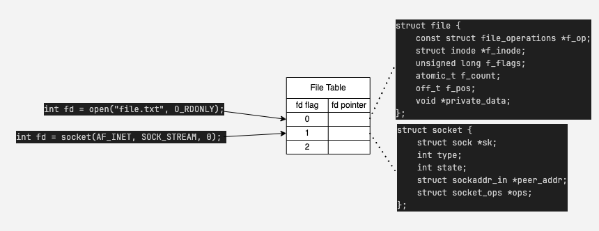
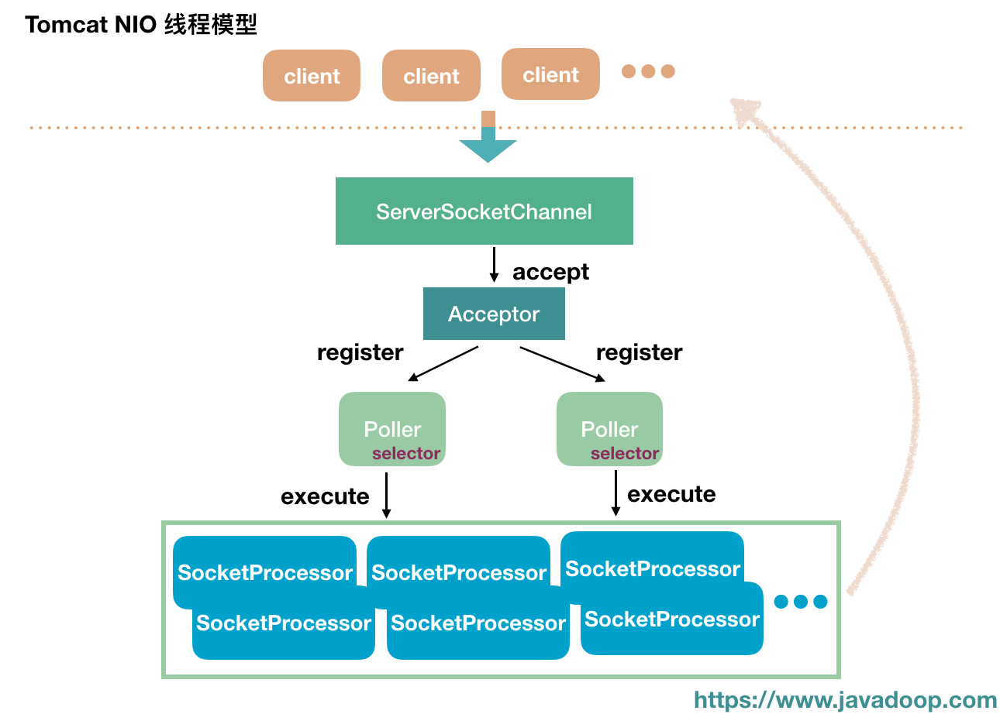
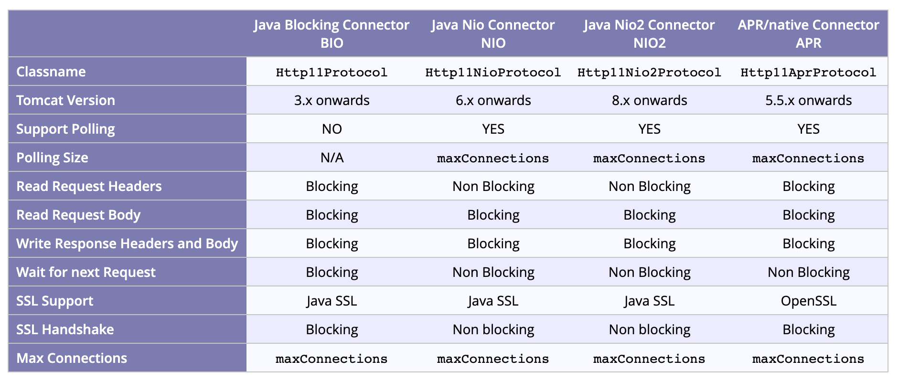

# 배경

오래전에 다음과 같은 [글](https://claycat.github.io/web_servers/)을 작성한 적이 있습니다.

웹서버를 가동할 때 왜 3000번, 8000번과 같이 하나의 포트만 충분한지에 대해서 고민했던 글이었는데,

내용이 아쉬운 부분도 있고, 당시 해결하지 못한 궁금증을 정리하고자 다시 글을 작성하게 되었습니다.

### 소켓

자료들에서 나오는 응답들은 일반적으로 두가지 부류임

1. 네트워크 연결 엔드포인트의 추상화
2. 네트워크 세션을 수립할 수 있는 읽고 쓸 수 있는 파일 핸들

그러면 파일 핸들러 어쩌구는 뭐임? 

이 내용을 알아두면 좋을 것 같음.

파일을 열 때, 리눅스 커널은 해당 자원을 표현하기 위해 양의 정수 하나를 배정해서 활용함

퀴즈) 파일을 열 때 운영체제는 무엇을 사용했지?

```typescript

int fd = open("file.txt", O_RDONLY);
read(fd, buf, n);    
write(fd, buf, n); 
close(fd);    

```

그래서 왜 파일 이야기가 나왔냐 하면, 리눅스에서는 이 FD를 통해서 IO 리소스에 접근하기 때문임.

파일을 열든, 네트워크 소켓을 열든, 파이프를 열든 리눅스는 모두 FD라는 양의 정수 하나를 사용함.

일종의 추상화 개념이라고 생각해도 좋음

리눅스가 기반으로 하는 UNIX 시스템 자체가 애초에 파일 IO를 바탕으로 시작했기 때문에 인터페이스들은 

open(), read(), write(), close()와 같이 발달했고, 네트워크가 추가됐을 때도 이를 재사용한것임



### 커넥션

잠깐 다른 이야기로 넘어갔는데, 다시 돌아와보겠음

소켓이 연결의 엔드포인트라면 연결은 총 5가지의 속성으로 정의됨

1. source port
2. source ip
3. protocol
4. destination port
5. destination ip

그렇다면 궁금증이 생길 수 있음

당연히 3000번이나 8000번 하나만으로 충분한거 아님?

1,2,3번은 고정되어있고 4,5번은 다른거 아닌가?

실제로 문제가 되는 부분은 따로 있음

실제 연결 상황에서는 하나의 클라이언트가 호스트와 여러개의 연결을 맻는 상황이 다수임

궁금하다면 명령어를 쳐보길 바람

`(WINDOWS) netstat -ano | findstr '443'`  
`(MAC): netstat -an | grep 443`  

이 문제를 해결하기 위해서 운영체제는 저번 호스팅에서 이야기한 ephemeral port를 사용함

중요한건 호스트가 사용하는게 아니라 접속하는 클라이언트 측에서 사용한다는거임

예를 들어 클라이언트가 여러개의 탭을 띄워서 웹서핑을 한다면 다음과 같이 표현될 수 있음

```typescript
 
Client_IP:54321 <--> Server_IP:443
Client_IP:54322 <--> Server_IP:443
Client_IP:54323 <--> Server_IP:443

```

### KeepAlive & Thread per Request

> 쉬어가기 - Processes and ThreadsPermalink  
> 옛날 웹서버들은 사실 하나의 연결당 하나의 프로세스를 배정하는 process-per-connection 정책을 사용하였다.  
> 다만 IPC와 프로세스 생성 / 해제의 오버헤드로 인해 프로세스가 아닌 스레드를 배정하는  
> thread-per-connection 정책을 사용하거나, nodejs와 같은 비동기 방식을 채택하였다.  

> HTTP/1.1 - Connection OverheadPermalink  
> 연결 요청마다 매번 새로운 소켓을 생성하고 TCP 요청을 수립하는것은 당연히 비효율적일 것이다.  
> 이를 해결하기 위해 HTTP/1.1 스펙에서는 Keep-alive라는 옵션이 추가되어, 연결을 재사용하는것이 가능하게 되었다.  

> KeepAlive & Thread per request?  
> HTTP/1.1의 KeepAlive는 추가적인 요청에 대해서 연결을 재활용하기 위해 바로 스레드가 반납되지 않고 잠깐 살아있게 된다.  
> 이게 Thread per request 모델과 공생이 가능할까?  

RFC는 딱히 연결을 처리하는 모델에 대한 표준을 정의하고 있지 않지만, 대부분의 현대 웹서버들은 Thread-Per-Request 모델을 채택하고 있음

위 의문을 해결하기 위해서는 운영체제가 담당하는 연결의 범위와 웹서버(톰캣)이 담당하는 연결의 범위를 알아야 함

가장 우선적으로, 연결에 대한 권한은 운영체제의 TCP/IP 스택이 갖고 있음
우리에게 익숙한 3-way handshake 부터, SYN과 ACK 큐를 관리하고 소켓에 대한 상태관리 또한 전담하고 있음

이제 연결에 대한 처리는 톰캣으로 넘어감  

톰캣의 역사와 함께 단계적으로 다루어 보도록 하겠음

## 톰캣

### 구성요소

#### Connector

톰캣의 진화는 Connector라는 중심 컴포넌트를 바탕으로 설명할 수 있음

Connector의 역할은 TCP 포트를 바인딩하고 스레드 풀을 관리함

다양한 구현체가 존재함

1. Http11Protocol (BIO) (Blocking IO)
2. Http11AprProtocol (APR) (Native APR)
3. Http11NioProtocol (NIO) (Non-blocking)

IntelliJ와 같은 최신 IDE들의 경우 톰캣에 대한 설정들을 대부분 자체적으로 처리해주기 때문에 크게 신경쓸 일이 없지만,  
직접 톰캣을 설치해본적이 있다면 server.xml 이라는 파일 아래에 명시되어있음.

그 밖에도 컴포넌트들이 존재함

#### Worker Thread

maxThread 값으로 정의된 쓰레드 풀.  
HTTP 요청이 들어오면 요청 파싱 - servlet 전달 - 응답 후 다시 풀로 돌아감

### BIO

하나의 쓰레드가 하나의 연결을 전담하여 처리함

즉, 쓰레드가 소켓을 직접 받고 응답할때까지 IO를 모두 Blocking함

그래서 Blocking IO이며, 예상대로 높은 동시 다발적 요청에는 효율이 떨어짐.

톰캣 9부터는 지원종료

### APR

BIO와 동일하게 연결당 쓰레드가 할당 + 약간의 최적화

### NIO

톰캣 6부터 등장한 논블로킹 커넥터.

커넥터가 관리하는 쓰레드 풀에서 Acceptor와 Poller 쓰레드가 분리됨.

1. Acceptor 쓰레드는 소켓을 SocketChannel로 감싸고 Selector에 등록하는 함수인 accept() 만을 담당
2. Poller 쓰레드는 채널의 IO가 준비될 때 Selector.select()를 호출하는 역할
3. SocketProcessor Task가 worker pool로 넘겨져서 실제 HTTP 요청을 받고 응답까지 이어나감




#### 그럼 이거 Node랑 비슷한거 아님?



### 부록: Netty? Jetty? WebFlux?